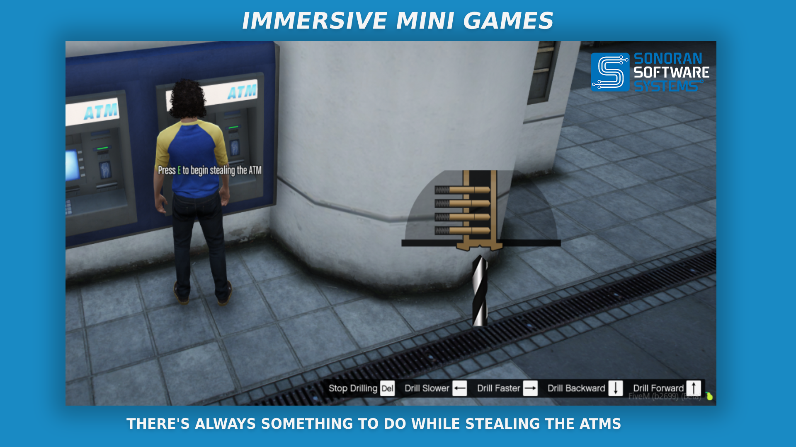
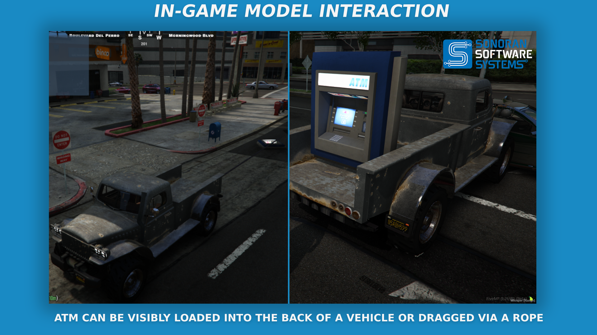
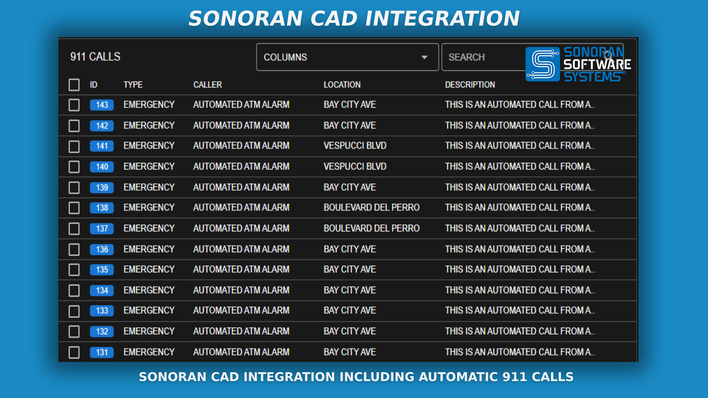
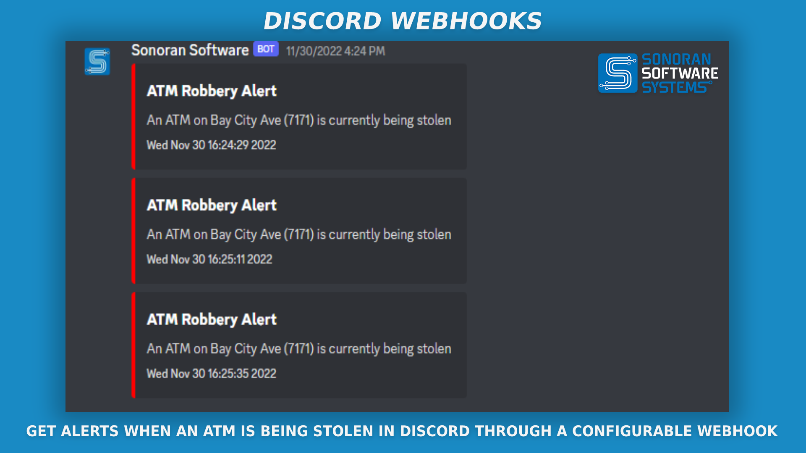
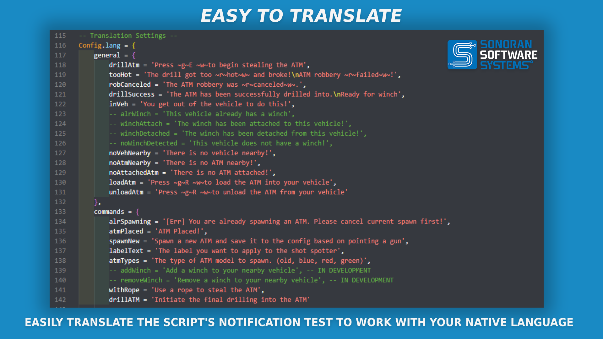

# 🏧 ATM Robbery


ATM Robbery Promotional Video


## ATM Robbery

### Features

.png>)

### Changelog

#### v1.0.4

* `fix: Fixed permission check for QB Core to check on character login`

#### v1.0.2

**Features**

* `feat: Add Ox_Inventory & Quasar Inventory support`

#### v1.0.1

**Hotfix**

* `fix: Typo in config.lua`

#### v1.0.0

* `Initial Release`
