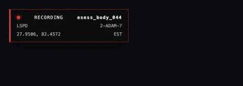

# Bodycam recording

Bodycam maintains pre-event context around each eligible wearer so an incident can include what happened before the trigger. The shipped setup keeps 60 seconds of pre-event activity, captures within 85 metres of the wearer, and allows a manual recording to run for up to 30 minutes.

## Controls and commands

| Action | Default key | Command |
| --- | --- | --- |
| Open Body-Worn Camera Evidence | F6 | /bodycam |
| Start or stop recording | F11 | /bodycamrecord |
| Add a marker | None | /bodycammark [label] |
| Save the current buffer | - | /bodycamsave |
| Activate panic recording | - | /bodycampanic |
| Open evidence review | - | /bodycamreview |
| Open the same terminal for administrative work | - | /bodycamadmin |

Players can change registered FiveM key mappings in their FiveM settings. The server owner can change the shipped defaults in eventsBodycam/config/config.lua. Marker has no default key to reduce conflicts; set `Config.Keys.Marker` if your server wants one.

Adding a manual marker requires access to the active recording and bodycam.annotate or a qualifying framework job grade.

## Manual recording

1. Join with an eligible wearer.
2. Press F11 or open the terminal and select **Start recording**.
3. Add markers when important moments occur.
4. Press F11 again or select **Stop recording** to finalize the evidence.

The recording overlay displays the active recording ID, department, callsign, coordinates, and timezone label. The overlay is hidden while the full terminal is open so it does not cover the evidence interface.

<figure><figcaption>
The compact overlay keeps recording identity, department, callsign, location, and timezone visible while the terminal is closed.
</figcaption></figure>

## Save the current buffer

Use **Save buffer** or /bodycamsave when something important has just happened. This starts a manual recording that includes the configured pre-event period. Stop the recording when the incident is complete; otherwise the configured maximum duration still applies.

## Automatic triggers

The shipped configuration supports:

* The wearer discharging a weapon
* A health loss that reaches the configured damage delta
* The wearer reaching the officer-down health threshold or dying
* A panic activation
* A trigger supplied by a configured dispatch integration

Automatic recordings finalize after the configured post-event period. If a trigger occurs while a recording is already active, Bodycam adds a validated marker to that recording instead of creating a second session.

## Configure triggers

Edit `Config.Triggers` in eventsBodycam/config/config.lua. Set Gunshot, Damage, OfficerDown, or Panic to false to disable that trigger. `DamageDelta` controls the minimum observed health loss, and `OfficerDownHealth` controls the down threshold.

The client detects the local health or weapon event, but the server still checks the wearer binding, permissions, allowed trigger, request limits, and current session before recording or adding a marker.

## What is recorded

Bodycam preserves the gameplay state needed to reconstruct relevant players, vehicles, peds, objects, projectiles, explosions, weapon events, damage events, movement, environment, and evidence markers around the wearer. The default product records voice and radio activity as event metadata only; it does not capture native voice audio.

The camera follows one configured player-bone perspective. A reviewer cannot switch to vehicle-style alternate views during Bodycam replay.
