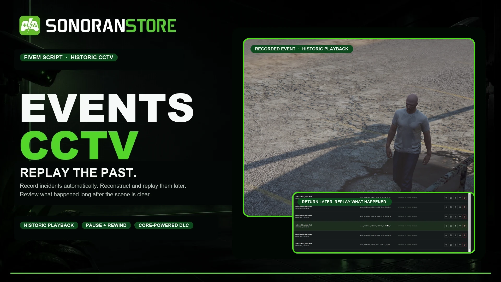
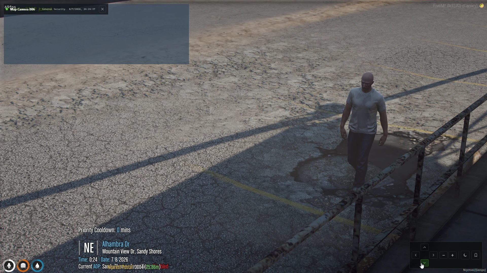

# CCTV

CCTV gives your FiveM server a persistent camera network that does more than show a live feed. Cameras record activity around motion detections and operator bookmarks so authorized staff can return later, find the incident in the archive, and replay what happened after the people and vehicles have left.

<figure><figcaption>
Record incidents automatically, then return later to review the scene.
</figcaption></figure>


**CCTV is a paid DLC for the free Events Core package.** Install Events Core once to provide the shared recording, replay, storage, and event logic required by CCTV and other Events DLC. Events Core does not add a separate gameplay interface by itself.


## Replay the past

CCTV preserves the activity around an incident instead of requiring an operator to watch every camera live. Motion events and manual bookmarks create archive entries with before-and-after context. Reviewers can later open a recording and control the historic playback.

<figure><figcaption>
A subject captured from a configured CCTV camera.
</figcaption></figure>

Historic playback includes:

* Play, pause, seek, restart, and timeline navigation
* Skip backward or forward and step through the recording
* Adjustable playback speed
* The camera angle saved when the incident occurred
* Archive controls for reviewing, preserving, exporting, or sharing recordings when configured

<figure><figcaption>
Motion detections and bookmarks remain available in the archive for later review.
</figcaption></figure>

## Complete camera management

* Create persistent terminals and organize cameras into permission-controlled groups
* Place and reposition cameras in the world
* View cameras live with zoom and optional pan or tilt
* Configure field of view, capture range, event cooldowns, and retention
* Enable motion-triggered recordings or create manual bookmarks
* Use normal, night-vision, and configured viewing modes
* Optionally discover compatible CCTV props already included in maps and MLOs
* Control administrators, live viewers, reviewers, deletion, uploads, Discord sharing, and remote access with ACE permissions

<figure><figcaption>
Persistent terminals and permission-filtered cameras appear in one operator interface.
</figcaption></figure>

## How it works

1. An administrator creates a terminal and adds one or more cameras.
2. A camera detects configured activity, or an operator creates a bookmark.
3. Events Core preserves the incident with pre-event and post-event context.
4. The recording appears in the CCTV archive.
5. An authorized reviewer opens the recording and replays the historic scene.

CCTV can also be used for live monitoring, but live viewing is not required for an incident to be recorded.

## Requirements

| Requirement | Details |
| --- | --- |
| Events Core | Free required package: [download Events Core](https://sonoran.store/packages/7606652-events-core) |
| Events CCTV | Paid DLC package: [download CCTV](https://sonoran.store/packages/7606654-events-cctv) |
| FXServer | A current FiveM server with OneSync enabled |
| Permissions | ACE permissions for administrators, operators, and reviewers |
| Framework | Standalone by default; ESX, QBCore, and Qbox context can be configured |
| Database | No SQL database is required by the default configuration |

## Start here

1. Follow [Installation](installation.md) to install Events Core and CCTV in the correct order.
2. Review [Configuration](configuration.md) and [Permissions](permissions.md).
3. Create your first terminal and camera with [Camera Setup](camera-setup.md).
4. Test both live viewing and [Historic Playback](playback.md).

For help, see [Troubleshooting](troubleshooting.md) or contact [Sonoran Software support](https://support.sonoransoftware.com/).
