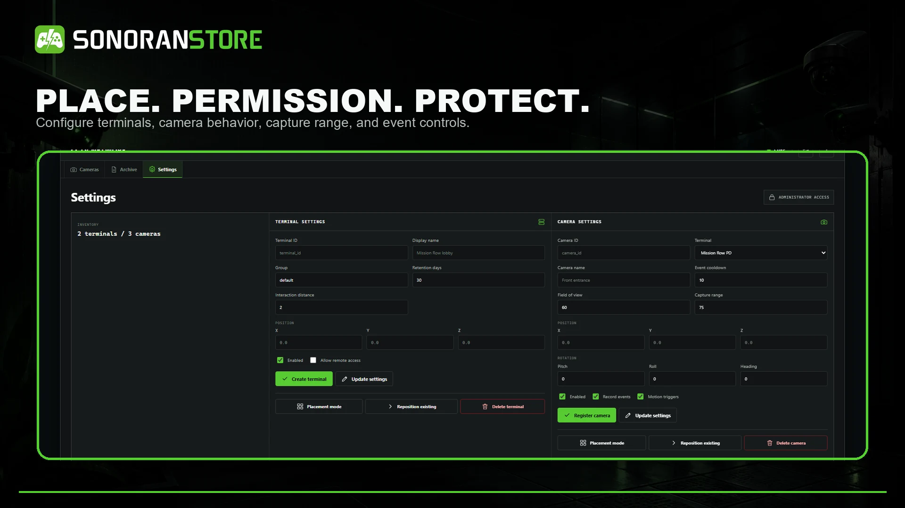
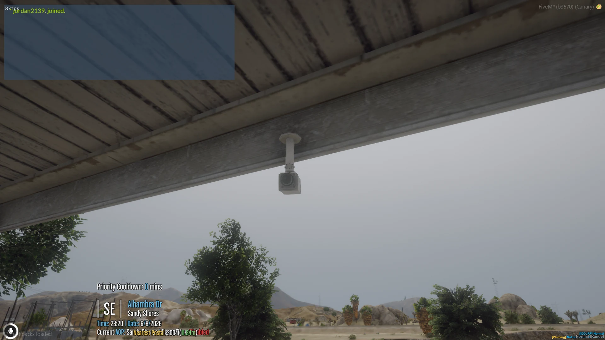
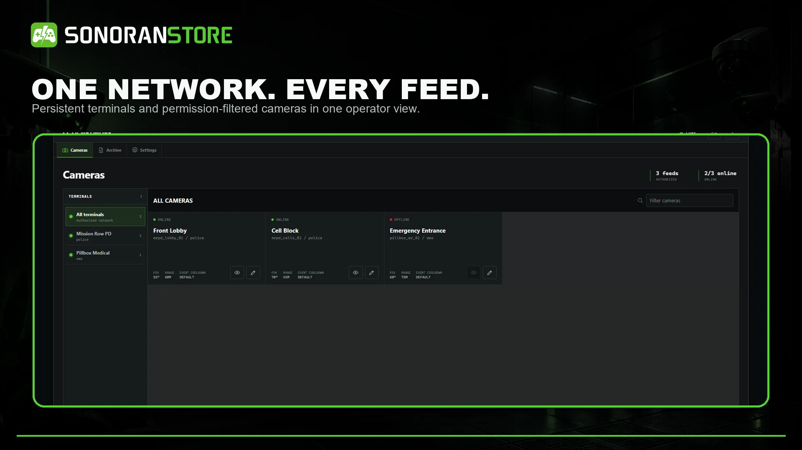

# CCTV camera setup

A terminal controls which cameras an operator can see and how long recordings are retained. Cameras define the viewpoint, field of view, capture range, motion behavior, and viewing capabilities.

<figure><figcaption>
Create, place, reposition, and manage terminals and cameras from the Settings tab.
</figcaption></figure>

## Create a terminal

1. Run /cctv with cctv.admin.
2. Open **Settings**.
3. Enter a unique terminal ID and a customer-facing display name.
4. Choose a group and retention period.
5. Set the interaction distance and enable remote access only if required.
6. Select **Placement mode** to place the terminal, or enter coordinates.
7. Save the terminal.

Use groups such as police, fire, or a location name to keep access narrow. Terminal access can be controlled with <code>cctv.terminal.&lt;terminalId&gt;</code> and remote groups with <code>cctv.remote.&lt;group&gt;</code>.

## Create a camera

1. Select the destination terminal.
2. Enter a unique camera ID and name.
3. Configure the event cooldown, field of view, and capture range.
4. Enable recording and motion triggers as required.
5. Select **Placement mode** to position and aim the camera.
6. Save the camera.
7. Open the live view and confirm the intended area is visible.
8. Trigger a test recording and verify its historic playback.

<figure><figcaption>
A configured CCTV camera mounted in the game world.
</figcaption></figure>

## Camera defaults and limits

| Setting | Shipped value |
| --- | --- |
| Model | prop_cctv_cam_01a |
| Field of view | 60 degrees |
| Zoom range | 25–90 degrees |
| Capture range | 75 metres |
| Motion cooldown | 10 seconds per entity |
| Cameras per terminal | Up to 32 |
| Maximum capture range | 250 metres |
| Recording and motion | Enabled |
| Zoom | Enabled |
| Pan and tilt | Disabled unless supported by the camera |

Moving or deleting a live camera does not change the angle saved with an already finalized recording.

## Camera models and offsets

Custom map or MLO models must be added to the allowed-camera list and given a model-specific position offset, rotation offset, and field of view. CCTV models do not all point along the same local axis, so test each model in its actual interior.

Always verify a manual camera's live view, historic playback perspective, routing bucket, and duplicate behavior before enabling automatic discovery.

## Automatic map and MLO cameras

Automatic discovery is optional and disabled by default. When enabled, CCTV scans nearby streamed camera props and registers them as normal logical cameras.

Edit eventsCctv/config/cameras.lua:

~~~lua
Config.AutoEnrollMapCameras.enabled = true
Config.AutoEnrollMapCameras.scanOnResourceStart = true
Config.AutoEnrollMapCameras.scanOnAreaChange = true
Config.AutoEnrollMapCameras.scanCooldown = 10000
Config.AutoEnrollMapCameras.scanRadius = 250.0
Config.AutoEnrollMapCameras.maxAutoEnrolledCameras = 500
Config.AutoEnrollMapCameras.activateOnDiscovery = true
Config.AutoEnrollMapCameras.persistDiscoveredCameras = true
~~~

The shipped compatible model list includes:

~~~text
prop_cctv_cam_01a, prop_cctv_cam_01b, prop_cctv_cam_02a,
prop_cctv_cam_03a, prop_cctv_cam_04a, prop_cctv_cam_04b,
prop_cctv_cam_04c, prop_cctv_cam_05a, prop_cctv_cam_06a,
prop_cctv_cam_07a
~~~

For a custom model, add it to both configured model allowlists and define its offsets:

~~~lua
Config.AutoEnrollCameraModelSettings['my_mlo_cctv'] = {
    positionOffset = { x = 0.0, y = -0.35, z = 0.15 },
    rotationOffset = { x = -15.0, y = 0.0, z = 180.0 },
    fov = 65.0
}
~~~

## Discovery commands

~~~text
/camerascan
/cameraautoscanstatus
/cameracleanauto confirm
/cameracleanauto stale confirm
~~~

These commands require cctv.admin. Enter an MLO before scanning so its objects are streamed. Review the status repeatedly before using a cleanup command; cleanup does not remove manually configured cameras.

<figure><figcaption>
Configured and automatically enrolled cameras use the same operator network.
</figcaption></figure>
