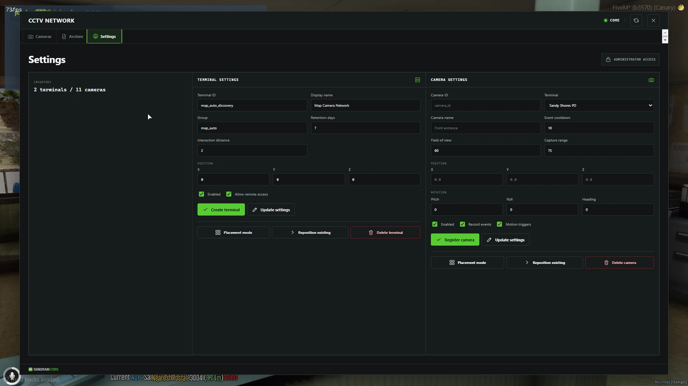

# CCTV configuration

CCTV ships with conservative defaults and does not require a roleplay framework. It still requires the free Events Core package. Test configuration changes before using the system for production evidence workflows.

<figure><figcaption>
Administrators can manage terminals, cameras, capture settings, and placement from the CCTV interface.
</figcaption></figure>

## Configuration files

### Events Core

| File | Purpose |
| --- | --- |
| eventsCore/config/config.lua | Framework context, recording limits, pre-event and post-event timing, replay limits, and retention |
| eventsCore/config/storage.lua | Local storage limits and optional allowed playback hosts |
| eventsCore/config/permissions.lua | Permission behavior and trusted helper resources |
| eventsCore/config/integrations.lua | Optional Discord settings |

### CCTV

| File | Purpose |
| --- | --- |
| eventsCctv/config/config.lua | Interaction, live view, remote access, motion detection, overlays, and persistence |
| eventsCctv/config/cameras.lua | Camera defaults, models, presets, and optional map-camera discovery |
| eventsCctv/config/permissions.lua | CCTV ACE nodes and terminal access prefixes |
| eventsCctv/config/remote.lua | Server-only allowlist for trusted remote integrations |
| eventsCctv/config/update.lua | Informational update-check toggle |

Keep API tokens, Discord webhooks, and private endpoints in server-only files. Never place credentials in client configuration or NUI files.

## Important shipped defaults

| Setting | Default |
| --- | --- |
| Interaction mode | Text interaction with supported target-system options |
| Terminal model | prop_monitor_01c |
| Interaction distance | 2 metres |
| Camera model | prop_cctv_cam_01a |
| Camera field of view | 60 degrees |
| Camera capture range | 75 metres |
| Motion polling | Every 500 ms |
| Motion cooldown | 10 seconds per entity |
| Minimum motion | 0.75 metres |
| Pre-event / post-event context | 15 seconds each |
| Recording retention | 7 days by default |
| Maximum configured retention | 90 days |
| Maximum live viewers | 8 per camera |
| Remote-view session | 300 seconds |
| Persistence | Enabled at eventsCctv/data/cctv.json |
| Night vision | Enabled |
| Thermal mode | Disabled |

## Framework selection

Events Core is standalone by default. Set its supported framework option to esx, qbcore, qbox, or automatic detection only when that framework is available on the server. ACE remains the default permission source.

## Recording and retention

Events Core stores the incident data used for historic playback under eventsCore/data/recordings by default. CCTV stores terminal and camera configuration in eventsCctv/data/cctv.json.

Measure available disk space and establish a backup policy before increasing retention. Recordings can contain player, vehicle, and incident information.

## Optional integrations

Discord, remote viewing, external storage, and recording uploads are optional and disabled or restricted by default. Enable one integration at a time on a test server, keep credentials server-side, and grant only the required permissions.

## Map and MLO cameras

Automatic discovery of compatible camera props is disabled by default. Configure and verify a manual camera first, then follow [Camera Setup](camera-setup.md#automatic-map-and-mlo-cameras) before enabling discovery.
