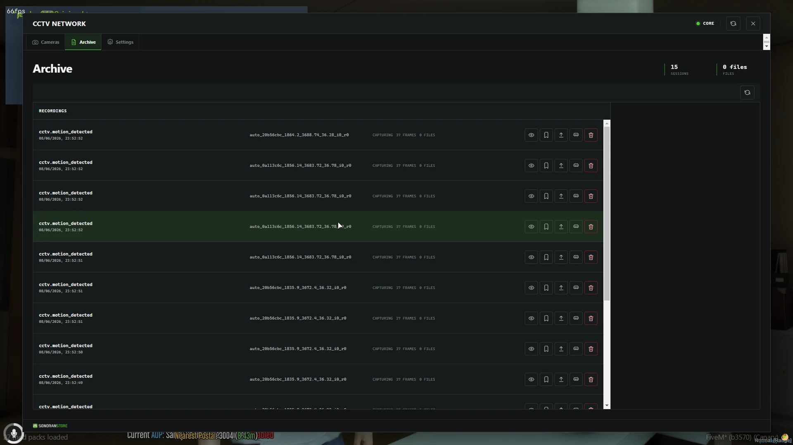
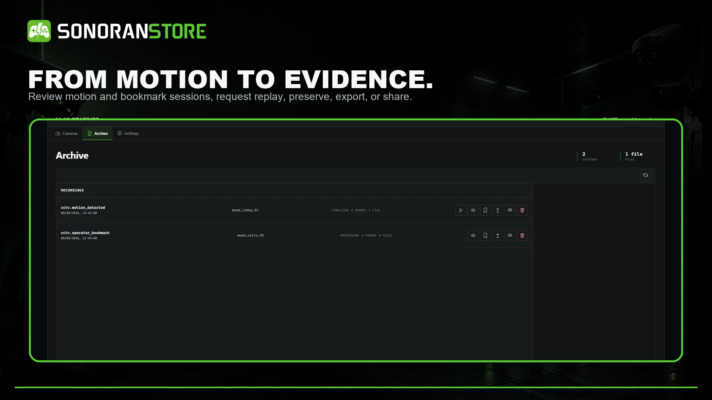
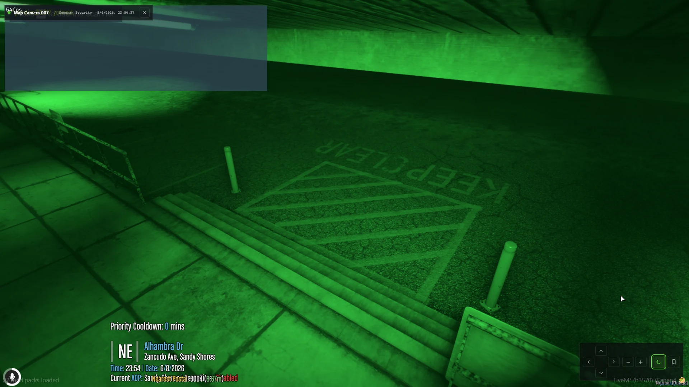

# Live view and historic playback

CCTV is built around historic review. Operators do not need to be watching a camera when an incident happens: configured motion detections and bookmarks create recordings that can be opened later from the archive.

<figure><figcaption>
The archive lists captured incidents for authorized reviewers.
</figcaption></figure>

## Record an incident

A recording can begin from:

* A configured motion detection
* An operator bookmark
* Another supported, authorized event workflow

Events Core preserves pre-event and post-event context so the replay is not limited to the exact instant that triggered it. Each finalized recording keeps the camera definition and angle from the time of the incident.

## Review historic footage

1. Run /cctv.
2. Open **Archive**.
3. Find the recording by event type, camera, or time.
4. Select the view or play action.
5. Use the playback controls to review the incident.

Reviewers can pause, seek, skip backward or forward, step through the timeline, restart, and change playback speed. Moving or deleting the current camera does not rewrite the viewpoint saved with a completed recording.

<figure><figcaption>
Return later and replay what happened after the scene has cleared.
</figcaption></figure>

## What is preserved

Events Core records the gameplay state required to recreate the incident, including relevant entities, movement, the environment, event markers, and the camera perspective. This makes later in-game replay possible without continuously streaming a live camera to an operator.

When optional upload, export, or Discord workflows are configured, the archive actions and permissions control who can create or share an additional recording artifact.

## Live view

Live view opens the selected camera immediately. Each camera supports up to eight viewers by default. Zoom is enabled; pan and tilt depend on the camera's configured capabilities.

Live view and historic recording are separate workflows. Watching a feed does not replace motion or bookmark recording, and a recording can be captured without anyone viewing the feed.

## Night vision and overlays

The shipped presentation includes timestamps, the Sonoran Security watermark, and night vision. Thermal viewing is disabled by default.

<figure><figcaption>
Night vision can be toggled for dark locations when enabled in configuration.
</figcaption></figure>

## Retention and storage

The default recording retention is seven days, with a configured maximum of 90 days. Local recording data is stored under eventsCore/data/recordings; terminal and camera state is stored in eventsCctv/data/cctv.json.

Use the archive's preserve and deletion controls only with the corresponding permissions. Back up evidence data securely before updates or storage changes.
