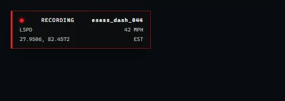
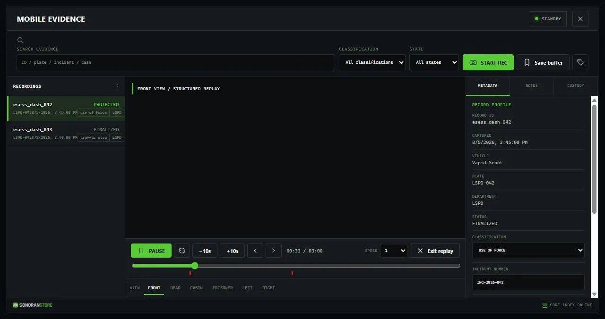

# Dashcam

Dashcam gives emergency and fleet vehicles a complete mobile-evidence workflow. It can preserve activity before and after an incident, start from manual or automatic triggers, and let authorized staff return later to review what happened from six vehicle-mounted viewpoints.

<!-- PROMO PLACEHOLDER: Add .gitbook/assets/dashcam-hero.webp here. Recommended shot: marked patrol vehicle at night with the recording overlay and Mobile Evidence terminal visible. -->


**Dashcam is a paid DLC for the free Events Core package.** Install Events Core once to provide the shared recording, replay, storage, and event logic required by Dashcam and other Events products. Events Core does not add a separate gameplay interface by itself.


## Capture the full incident

The rolling pre-event buffer helps preserve what led up to an incident, not only what happened after the record button was pressed. A recording can begin manually or from configured activity such as emergency lights, a siren, a collision, a nearby gunshot, or a speed threshold.

Operators can:

* Start or stop a recording from the evidence terminal, a keybind, or a command
* Save the current buffer with the configured pre-event context
* Add labeled evidence markers while a recording is active
* See recording status, department, speed, and coordinates in the in-game overlay
* Search finalized evidence by recording, vehicle, plate, department, incident, case, citation, or arrest-report information

<figure><figcaption>
The compact overlay keeps the recording ID, department, speed, location, and timezone visible while the terminal is closed.
</figcaption></figure>

## Review from six viewpoints

Each vehicle recording can be reviewed from front, rear, cabin, prisoner, left, and right views. Reviewers can play, pause, seek, skip, step through the timeline, change speed, and switch viewpoints without returning to the original vehicle.

Dashcam replay reconstructs the recorded incident inside FiveM. It is not a conventional video file by default, so historic review does not depend on someone watching or streaming the camera live when the incident occurs.

<figure><figcaption>
Review the recorded timeline and switch among all six vehicle-mounted viewpoints.
</figcaption></figure>

## Manage evidence access

ACE permissions and optional framework job grades control who can record, review their own or departmental evidence, add notes, classify records, lock or archive evidence, change retention, and delete unprotected records. The shipped retention policy includes separate periods for routine recordings, traffic stops, arrests, use-of-force incidents, training, and indefinite retention.

## How it works

1. An authorized driver enters an eligible vehicle.
2. A manual or automatic trigger starts a recording with pre-event context.
3. The recording captures the configured area around the moving vehicle.
4. The finalized record appears in the Mobile Evidence terminal.
5. An authorized reviewer searches for the record, opens it, and replays the incident from any of the six views.

## Requirements

| Requirement | Details |
| --- | --- |
| Events Core | Free required package: [download Events Core](https://sonoran.store/packages/7606652-events-core) |
| Events Dashcam | Paid Dashcam DLC from the Sonoran Store and your Cfx.re granted assets |
| FXServer | A current FiveM server with OneSync enabled |
| Permissions | ACE permissions or a supported framework job setup |
| Framework | Standalone by default; ESX, QBCore, and Qbox context can be configured |
| Database | No SQL database is required by the default configuration |

<!-- PRODUCT LINK PLACEHOLDER: Link "Events Dashcam" above to its public Sonoran Store package URL when available. -->

## Start here

1. Follow [Installation](installation.md) to install Events Core and Dashcam in the correct order.
2. Review [Configuration](configuration.md), [Vehicle Setup](vehicle-setup.md), and [Permissions](permissions.md).
3. Test manual and automatic [Recording](recording.md) in an eligible vehicle.
4. Open the finalized record and test [Playback and Evidence](playback.md).

For help, see [Troubleshooting](troubleshooting.md) or contact [Sonoran Software support](https://support.sonoransoftware.com/).
