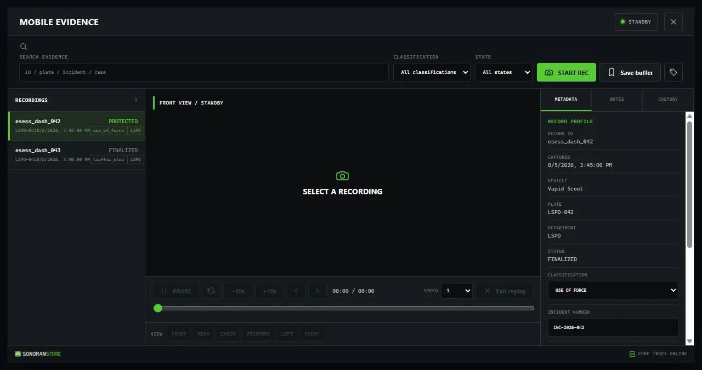

# Dashcam configuration

Dashcam ships with usable defaults and can run without a roleplay framework. It still requires the free Events Core package. Test changes on a non-production server before using the system for evidence workflows.

## Configuration files

### Events Core

| File | Purpose |
| --- | --- |
| eventsCore/config/config.lua | Framework selection, recording limits, replay speeds, processing, retention, and audit settings |
| eventsCore/config/storage.lua | Local storage limits and optional allowed playback hosts |
| eventsCore/config/permissions.lua | Permission behavior and trusted processing resources |
| eventsCore/config/integrations.lua | Optional CAD and Discord settings |

### Dashcam

| File | Purpose |
| --- | --- |
| eventsDashcam/config/config.lua | Branding, capture range, timing, triggers, keys, integrations, and request limits |
| eventsDashcam/config/cameras.lua | The six replay viewpoints, offsets, rotations, and fields of view |
| eventsDashcam/config/vehicles.lua | Eligible vehicle classes, models, plates, jobs, fleets, and inventory item |
| eventsDashcam/config/retention.lua | Retention days for each evidence classification |
| eventsDashcam/config/permissions.lua | Dashcam ACE nodes and framework job-grade rules |
| eventsDashcam/config/update.lua | Informational update-check toggle |
| eventsDashcam/integrations/ | Optional dispatch, inventory, phone, voice-metadata, CAD, Discord, and clip-provider bridges |

Keep API tokens, Discord webhooks, and private endpoints in server-only files. Never place credentials in client configuration or NUI files.

## Important shipped defaults

| Setting | Default |
| --- | --- |
| Capture radius | 85 metres around the vehicle |
| Pre-event context | 60 seconds |
| Automatic post-event time | 20 seconds |
| Maximum manual recording | 1,800 seconds (30 minutes) |
| Replay views | Front, rear, cabin, prisoner, left, and right |
| Open terminal | F7 |
| Start or stop recording | F9 |
| Add evidence marker | F10 |
| Trigger polling | Every 500 ms |
| Emergency lights, siren, and gunshot triggers | Enabled |
| Collision threshold | 35 points of vehicle body-health loss |
| Speed threshold | 44.7 m/s, approximately 100 mph or 161 km/h |
| Speed-trigger cooldown | 30 seconds |
| CAD and Discord actions | Disabled |
| Automatic update check | Disabled |

## Branding and units

Config.Brand controls the department name, product name, accent color, speed unit, timezone label, and privacy disclosure. SpeedUnit supports the shipped mph behavior or km/h presentation. The trigger threshold in Config.Triggers.SpeedMps is always configured in metres per second.

## Framework selection

Events Core is standalone by default. Set its supported framework option to esx, qbcore, qbox, or automatic detection only when that framework is installed and available. Framework jobs can provide standard or elevated Dashcam actions using the grade tables in eventsDashcam/config/permissions.lua.

## Recording and storage

Events Core stores the incident data used for historic replay under eventsCore/data/recordings by default. Measure available disk space and establish a backup policy before raising capture limits or retention periods. Recordings can contain player, vehicle, location, and incident information.

## Optional integrations

CAD, Discord, dispatch, phone, inventory, voice metadata, and generated clips require separate configuration. Their shipped bridges are disabled, empty, or metadata-only until you connect a compatible system. Enable one integration at a time on a test server and keep credentials server-side.

Dashcam's standard historic replay works without an encoded video file. Any separate video-generation or upload workflow requires a compatible, trusted recorder or processing setup in Events Core.

<figure><figcaption>
The Mobile Evidence terminal keeps recording controls, searchable evidence, replay, and record details in one interface.
</figcaption></figure>
