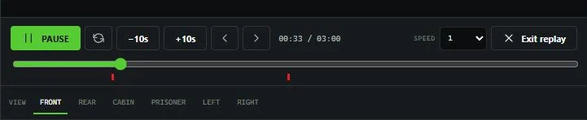

# Dashcam recording

Dashcam maintains pre-event context around each eligible vehicle so an incident can include what happened before the trigger. The shipped setup keeps 60 seconds of pre-event activity, captures within 85 metres of the vehicle, and allows a manual recording to run for up to 30 minutes.

## Controls and commands

| Action | Default key | Command |
| --- | --- | --- |
| Open Mobile Evidence | F7 | /dashcam |
| Start or stop recording | F9 | /dashcamrecord |
| Add a marker | F10 | /dashcammark [label] |
| Save the current buffer | - | /dashcamsave |
| Open evidence review | - | /dashcamreview |
| Open the same terminal for administrative work | - | /dashcamadmin |

Players can change registered FiveM key mappings in their FiveM settings. The server owner can change the shipped defaults in eventsDashcam/config/config.lua.

Adding a marker requires access to the active recording and the dashcam.annotate permission or a qualifying framework job grade.

## Manual recording

1. Enter an eligible vehicle as the driver.
2. Press F9 or open the terminal and select **Start recording**.
3. Add markers when important moments occur.
4. Press F9 again or select **Stop recording** to finalize the evidence.

The recording overlay displays the active recording ID, configured department, current speed, coordinates, and timezone label. The overlay is hidden while the full terminal is open so it does not cover the evidence interface.

## Save the current buffer

Use **Save buffer** or /dashcamsave when something important has just happened. This starts a recording that includes the configured pre-event period. Stop the recording when the incident is complete; otherwise the configured maximum duration still applies.

## Automatic triggers

The shipped configuration supports:

* Emergency lights changing state
* Siren changing state
* A collision that exceeds the configured body-damage threshold
* Crossing the configured speed threshold
* A gunshot within the configured radius
* A trigger supplied by a configured dispatch or other integration

Automatic recordings finalize after the configured post-event period. If another trigger occurs while a recording is already active, Dashcam adds it to the current timeline instead of creating a duplicate recording.

## Configure triggers

Edit Config.Triggers in eventsDashcam/config/config.lua. Set EmergencyLights, Siren, or Gunshot to false to disable those triggers. Set CollisionDamageDelta to 0 to prevent collision-based starts, or adjust SpeedMps and SpeedCooldownSeconds for your server's driving balance.

The speed threshold uses metres per second regardless of the speed unit displayed in the overlay. Common conversions:

| Target speed | SpeedMps value |
| --- | ---: |
| 80 mph / 129 km/h | 35.8 |
| 100 mph / 161 km/h | 44.7 |
| 120 mph / 193 km/h | 53.6 |

## What is recorded

Dashcam preserves the gameplay state needed to reconstruct relevant players, vehicles, peds, objects, projectiles, explosions, weapon events, damage events, movement, environment, and evidence markers around the vehicle. The default product records voice and radio activity as event metadata only; it does not capture native voice audio.

<figure><figcaption>
Event markers remain visible on the replay timeline alongside playback and viewpoint controls.
</figcaption></figure>
