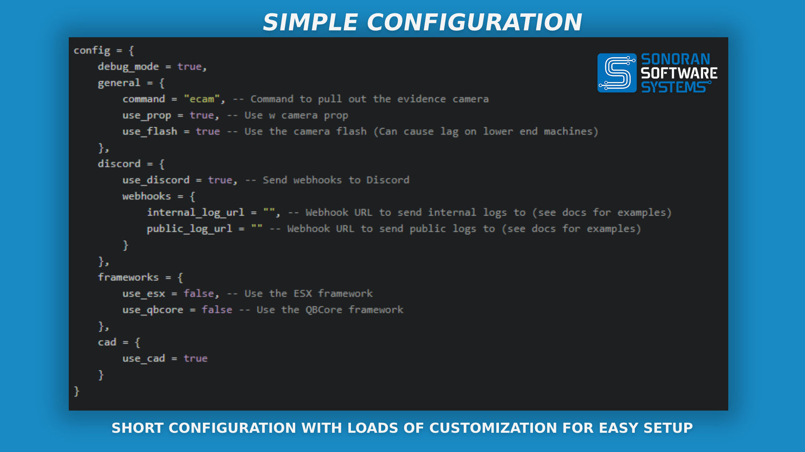
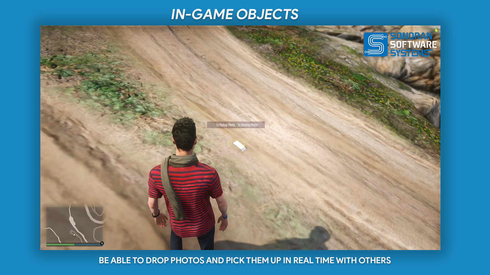
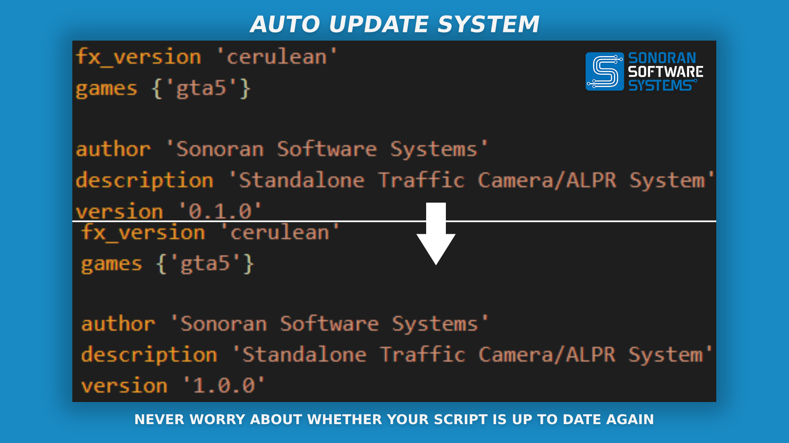
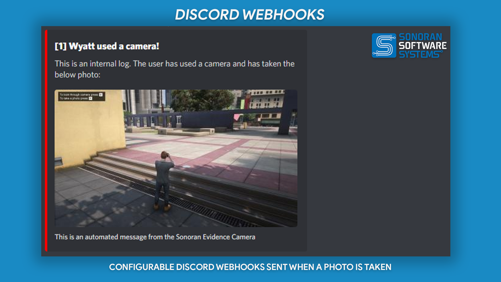
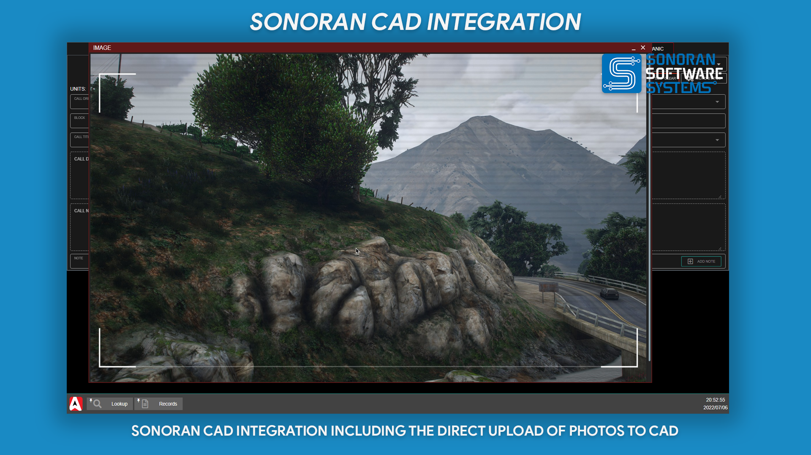
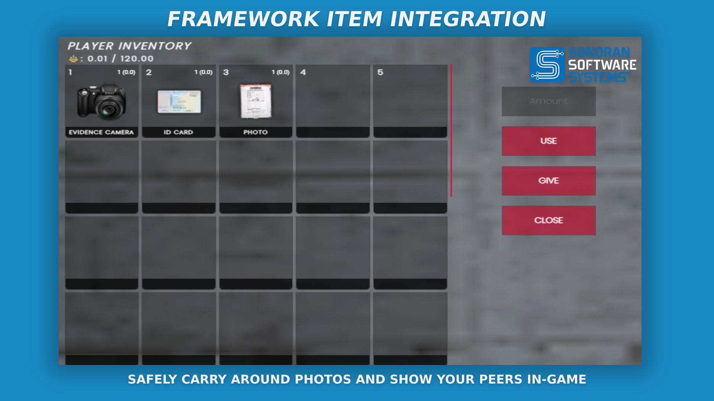

# 📸 Evidence Camera


Sonoran Software - Evidence Camera Promotional Video


## Evidence Camera

### Features

* Ability to operate standalone
* Support for ESX, QBCore, and Sonoran CAD &#x20;

<figure><figcaption>
Sonoran Software - Evidence Camera Promotional Image
</figcaption></figure>

<figure><figcaption>
Sonoran Software - Evidence Camera Promotional Image
</figcaption></figure>

<figure><figcaption>
Sonoran Software - Evidence Camera Promotional Image
</figcaption></figure>

<figure><figcaption>
Sonoran Software - Evidence Camera Promotional Image
</figcaption></figure>

<figure><figcaption>
Sonoran Software - Evidence Camera Promotional Image
</figcaption></figure>

<figure><figcaption>
Sonoran Software - Evidence Camera Promotional Image
</figcaption></figure>

### Commands

| Command Name | Command Description        | Required Permission |
| ------------ | -------------------------- | ------------------- |
| `/ecam`      | Toggle the evidence camera | None                |

### Changelog

#### v.1.2.6

**Feature Request**

* `Add config for capture button`
* `Move all English text to translation config in config.lua`

#### v1.2.5

**Hotfix**

* `Change event handler to register CAD endpoints correctly`

**Feature Request**

* `Add the ability for Fire and EMS to also use and upload photos to CAD`

#### v1.2.4

**Security Update**

* `Move Discord webhook configuration to strictly server sided file to prevent client dumps`

#### v1.2.3

**Hotfix**

* `Fix Ox_Inventory support with latest update`

#### v1.2.2

**Feature**

* `Added Quasar Inventory support`

#### v1.2.0

**Bugfixes**

* `Fixed numerous ESX bugs`

**Features**

* `Added support for Ox Inventory`
* `Added support for custom inventories`

#### v1.1.3

* `Standalone object duplication hot fix`

#### v1.1.2

* `Fix QBCore bug on newer servers`

#### v1.1.1

* `Fix QBCore object registration bug`

#### v1.1.0

* `Fix QBCore Camera`
* `Add photo object to inventory`
* `Misc bug fixes`

#### v1.0.1

* `Fix NUI bug (Please ensure resource name is sonoran-evidencecam)`

#### v1.0.0

* `Inital Release`
