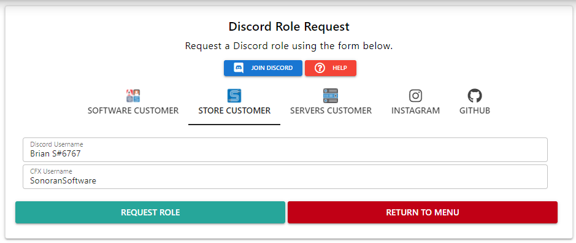

# ℹ️ Information

## Our Company

Learn more about Sonoran Software, who we are, and what we do.

[Visit our Website!](https://sonoransoftware.com)

### SonoranM for FiveM™️

<figure><figcaption>
SonoranM Promotional Image
</figcaption></figure>

Get the entire Sonoran store for just $19.99/mo! Purchase at [SonoranM.com](https://sonoranm.com)!

## Customer Support

Our support team has dedicated live chat hours 7 days/week! For assistance, reach out to [support.sonoransoftware.com](https://support.sonoransoftware.com).

## Discord Server

Join our [Discord server](https://discord.sonoransoftware.com) for news, updates, customer interaction, and more!

### Discord Customer Role

Gain access to our `#customer-lobby` channel when you purchase an item from the Sonoran Store!

#### 1. Copy your CFX Username

When you purchase an item from the Sonoran Store, a CFX (FiveM) login is required. You'll need to copy your CFX username. This can be found by logging into the [CFX forums](https://forum.cfx.re/).&#x20;

<figure><figcaption></figcaption></figure>

#### 2. Copy your Discord Username

Left-click on your Discord username to copy it.

<figure><figcaption>
Copy Discord Username
</figcaption></figure>

#### 3. Claim your Role

On support.sonoransoftware.com select `Discord Role` > `Store Customer` and enter in your credentials.&#x20;

<figure><figcaption>
Discord Role Request
</figcaption></figure>
