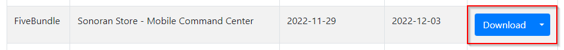

# ✅ Accessing Tebex Assets

There are two ways you can access your assets after you've purchased them through Tebex.

### Initial Purchase Receipt Email

After completing your purchase you should receive an email similar to the following.  From this email you can simply click the `Download Your Asset` button to download the zip file containing your asset. After you've downloaded your asset please proceed to the install documentation for the script you've downloaded.

<figure><figcaption></figcaption></figure>

### Keymaster

First you'll need to access and sign in to Keymaster with the account that is associated with the CFX name you provided during Tebex checkout. [You can access Keymaster here.](https://keymaster.fivem.net)

After you've logged in click on the `Granted Assets` button on the sidebar.

<figure><figcaption>
Keymaster - Granted Assets
</figcaption></figure>

On that page you can simply click download next to the asset which you wish to download. After downloading proceed to your assets install instructions.

<figure><figcaption>
Keymaster - Download Asset
</figcaption></figure>
