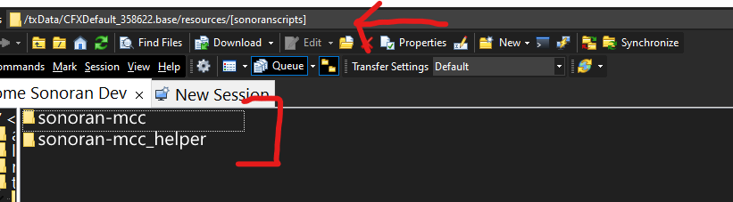
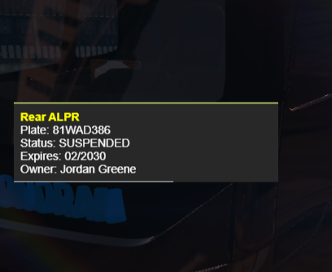
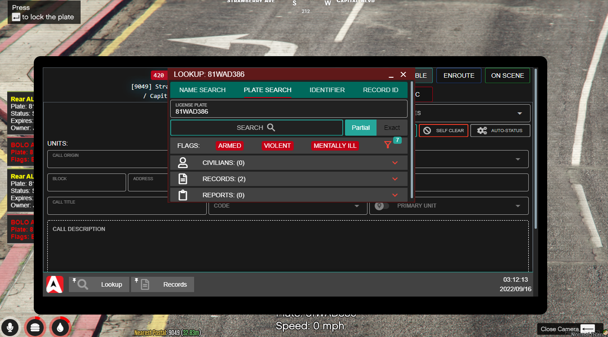

# Getting Started

## Acquire the Script

After purchasing the script through the Sonoran store you may [download the script through the keymaster account](../general/tebex-assets.md) that purchased the script. Upon downloading extract the file to a safe place.

## Install the Script

1.  Inside the script package you just extracted will be two folders. Copy both to a folder in your server's resources folder called `[sonoranscripts]` note the `[]` in the name, without them it will not work.&#x20;

    <figure><figcaption><p>Sonoran Software -  MCC - Folders</p></figcaption></figure>
2. In the `sonoran-mcc` folder there will be a folder called `config`, once inside that folder you should see a file called `config.CHANGEME.lua` you should rename that to be `config.lua` and configure the settings inside as you would like them to be configured based on the configuration documentation below.
3. In the `sonoran-mcc` folder there is the file `sonomcc.ytd`, move that file into the `sonoran-mcc/stream/` folder. This allows our updater to not override any custom YTD edits like custom liveries.
4. In the `sonoran-mcc/data/` folder there are 4 `.meta` files rename each file so that you remove`.CHANGEME` from the name. You should be left with the following 4 file names:

* carcols.meta
* carvariations.meta
* vehiclelayouts.meta
* vehicles.meta

5. Finally, in your `server.cfg` add the following:

```
ensure sonoran-mcc

add_ace resource.sonoran-mcc command allow
add_ace resource.sonoran-mcc_helper command allow
```

## Configuring The Script

<details>

<summary>Default <code>config.lua</code></summary>

```lua
config = {}
config.configuration_version = 1.3 -- Do NOT change unless updating whole config file. Used by updater to tell you when new config file options are available.
config.auto_update = true -- Toggle Auto Updater, requires ace permissions to function. See Install Docs: https://docs.sonoran.store
config.debug_mode = false
config.eBrakeWithSliders = true -- Should the vehicle activate the "E-BRAKE" when the sliders are out
config.speedType = 'mph' -- Which way should the alpr speed display? Options: 'mph' or 'kph'
config.keys = {
    -- Use https://docs.fivem.net/docs/game-references/controls/#controls to find the name...
    -- and use https://docs.fivem.net/docs/game-references/input-mapper-parameter-ids/keyboard/ to find index parameters for the key options below...
    cameraToggle = {cmd = 'mcccamera', name = 'INPUT_PICKUP', indexParam = 'e', lang = 'Access MCC Cameras'}, -- Key to access cameras
    interiorLightToggle = {cmd = 'mccintlights', name = 'INPUT_REPLAY_CYCLEMARKERRIGHT', indexParam = 'RBRACKET', lang = 'Toggle MCC Interior Lights'}, -- Key to toggle rear interior lighting
    radioRepeaterToggle = {cmd = 'mccradio', name = 'INPUT_REPLAY_CYCLEMARKERLEFT', indexParam = 'LBRACKET', lang = 'Toggle MCC Radio Repeater'}, -- Key to toggle Sonoran Radio repeater
    alprLockPlate = {cmd = 'mccplatelock', name = 'INPUT_FRONTEND_ENDSCREEN_ACCEPT', indexParam = 'RETURN', lang = 'Lock the current plate in the MCC ALPR'},
    menuToggle = {name = 'INPUT_SCRIPTED_FLY_ZUP', indexParam = 'PAGEUP'} -- Keybind to open the door control menu, can be changed in FiveM settings
}

-- Optional Menu/Commands/Keybinds controls for doors
config.doorControl = {
    method = 4, -- What method to use to control the doors | INTEGER | Options: 1 = commands, 2 = menu, 3 = none, 4 = commands & menu
    commands = {
        baseCmd = {cmd = 'mcctoggle', lang = 'Base MCC Toggle Command'}, -- Base command, see below for options
        antenna = {cmd = 'antenna', lang = 'Toggle MCC Antenna'}, -- toggle the antenna
        sliders = {cmd = 'sliders', lang = 'Toggle MCC Slide Out Sections'}, -- toggle the sliders
        rearDoor = {cmd = 'reardoor', lang = 'Toggle MCC Rear Door'}, -- toggle the read door
        frontLeft = {cmd = 'frontleft', lang = "Toggle MCC Driver's Door"}, -- toggle the front left door
        frontRight = {cmd = 'frontright', lang = "Toggle Passenger's Door"}, -- toggle the front right door
        allDoors = {cmd = 'all', lang = 'Toggle ALL MCC Doors'}, -- toggle all doors
        menuToggle = {cmd = 'togglem', lang = 'Toggle MCC Control Menu'} -- command to open the door control menu
    }
}

-- Translate the resource by customizing the messages below...
config.language = {
    mccHelpMessage = 'Press \n~' .. config.keys.cameraToggle.name .. '~ to access cameras \n~' .. config.keys.interiorLightToggle.name .. '~ to toggle interior lights',
    mccRadioHelpMessage = '\n~' .. config.keys.radioRepeaterToggle.name .. '~ to toggle mobile radio repeater',
    mccMenuHelpMessage = '\n~' .. config.keys.menuToggle.name .. '~ for more controls',
    radioRepeaterOn = 'MCC Radio repeater has been toggled on',
    radioRepeaterOff = 'MCC Radio repeater has been toggled off',
    notInMCC = 'You must be in the MCC to use this!',
    noValidArgument = 'You must provide a valid argument!',
    subCommand = 'Subcommand',
    subCommandOptions = 'Available options: ',
    missingSonoranRadio = 'Sonoran Radio not running, feature unavailable...',
    antennaNotUp = 'You must raise the antenna first!\n Use "/mcctoggle antenna" do to so',
    slidersOut = 'The MCC sliders are moving out... E brake will now engage.',
    slidersIn = 'The MCC sliders are now in... E brake will now disengange',
    intLightOn = 'The interior light has been toggled on!',
    intLightOff = 'The interior light has been toggled off!',
    alprLockPlate = 'Lock Plate'
}

config.alpr = {
    enabled = true, -- Enable Autmatic License Plate Reader on MCC Cameras
    enableSonoranCad = true, -- Enable sonorancad integration to alert on bolo/warrant/flag and be able to lock to force a CAD license plate lookup
    scanAi = false -- Allow passive lookups of AI plates, will be lots of spam if you enable notifying on "no registration" in sonorancad wraithv2 plugin
}

config.radio = {
    enabled = true, -- Enable MCC Mobile Repeater (requires sonoranradio resource and name must remain to be "sonoranradio")
    range = 750 --MCC Mobile repeater 
}
```

</details>


There is no permission configuration required for this resource.&#x20;


## Sonoran CAD Integration

### Functionality

The mobile command center is equipped with surveillance cameras on top of the radio antenna. While looking at a vehicle, the license plate will be displayed on-screen.

Additionally, with [Sonoran CAD's Wraith integration](https://info.sonorancad.com/integration-plugins/integration-plugins/available-plugins/wraithv2), a pNotify pop-up will display the vehicle's registration information from Sonoran CAD. Press `ENTER` to "lock" the plate and return a full search in your Sonoran CAD screen.

<figure><figcaption><p>Sonoran Software - MCC - ALPR</p></figcaption></figure>

<figure><figcaption><p>Sonoran Software - MCC - ALRP Locked</p></figcaption></figure>

### Configuration

The Sonoran CAD integration can be turned either on or off in the [`config.alpr`](getting-started.md#config.alpr-breakdown) section. In order for Sonoran CAD integration to work properly you **MUST** have the [Wraith Radar](https://info.sonorancad.com/integration-plugins/integration-plugins/available-plugins/wraithv2) CAD plugin installed. This plugin is part of [Sonoran CAD's integration framework](https://info.sonorancad.com/integration-plugins/integration-plugins).


Without the [Wraith Radar](https://info.sonorancad.com/integration-plugins/integration-plugins/available-plugins/wraithv2) plugin properly installed the ALPR **WILL NOT** work.


## Sonoran Radio Integration

### Functionality

The mobile command center is equipped with an extendable Sonoran Radio repeater. When extended, the mobile command center will function as a [Sonoran Radio tower](https://info.sonoranradio.com/tutorials/script-usage#in-game-towers) to increase reception in the area.

### Configuration

The Sonoran Radio integration is both automatic and seamless. In order for this to work you **MUST** have the [Sonoran Radio FiveM Script](https://info.sonoranradio.com/tutorials/in-game-radio) properly installed and configured.


Sonoran Radio's resource must remain named `sonoranradio` or integration **WILL NOT** work.



Without the [Sonoran Radio FiveM Script](https://info.sonoranradio.com/tutorials/in-game-radio) properly installed the Sonoran Radio integration **WILL NOT** work.


## Config Breakdown

<table><thead><tr><th width="259.3333333333333">Config Option</th><th width="317">Option Description</th><th>Possible Values</th></tr></thead><tbody><tr><td><code>configuration_version</code></td><td>This is used by the auto updater - simply don't touch it</td><td><code>Integer</code></td></tr><tr><td><code>auto_update</code></td><td>Would you like the script to automatically update to the newest version?</td><td><code>True</code> or <code>False</code></td></tr><tr><td><code>debug_mode</code></td><td>Would you like to enable debug prints?</td><td><code>True</code> or <code>False</code></td></tr><tr><td><code>eBrakeWithSliders</code></td><td>Would you like to enable/ disable the MCC's emergency brake when sliders are opened/ closed</td><td><code>True</code> or <code>False</code></td></tr><tr><td><code>speedType</code></td><td>How would you like to display the speed on the ALPR?</td><td><code>'mph'</code> or <code>'kph'</code></td></tr></tbody></table>

### `config.keys` Breakdown

| Config Option | Option Description                                                    | Possible Values                                                                                                |
| ------------- | --------------------------------------------------------------------- | -------------------------------------------------------------------------------------------------------------- |
| `cmd`         | The command that will be triggered                                    | `String`                                                                                                       |
| `name`        | The key that will be displayed in the help menu upon entering the MCC | `String` [See Here for options](https://docs.fivem.net/docs/game-references/controls/#controls)                |
| `indexParam`  | The default key that will be used to trigger said command             | `Key` [See Here for options](https://docs.fivem.net/docs/game-references/input-mapper-parameter-ids/keyboard/) |
| `lang`        | The description of what the key will do                               | `String`                                                                                                       |

### `config.doorControl` Breakdown

| Config Option | Option Description                           | Possible Values                                              |
| ------------- | -------------------------------------------- | ------------------------------------------------------------ |
| `method`      | How would you like to control the MCC doors? | `1` = commands - `2` = menu `3` = none `4` = commands & menu |
| `cmd`         | The command that will be triggered           | `String`                                                     |
| `lang`        | The description of what the command will do  | `String`                                                     |

### `config.language` Breakdown

Here you can imput your own translations or change the wording of all text prompts and popups.

### `config.alpr` Breakdown

| Config Option      | Option Description                                         | Possible Values   |
| ------------------ | ---------------------------------------------------------- | ----------------- |
| `enabled`          | Would you like to enable the MCC ALPR system?              | `true` or `false` |
| `enableSonoranCad` | Would you like the ALPR to run plates through Sonoran CAD? | `true` or `false` |
| `scanAi`           | Would you like the ALPR system to scan AI plates?          | `true` or `false` |

### `config.radio` Breakdown

| Config Option | Option Description                                       | Possible Values    |
| ------------- | -------------------------------------------------------- | ------------------ |
| `enabled`     | Would you like to enable the MCC Radio Repeater system?  | `true` or `false`  |
| `range`       | Would you like more or less mobile radio repeater range? | int defualt: `750` |

## Commands

These are the default names of commands, they may have been modified by the server owner.

| Command Name        | Command Description                                                                                                     |
| ------------------- | ----------------------------------------------------------------------------------------------------------------------- |
| `/mcctoggle [door]` | This is the base command that. (See [`Available Doors`](getting-started.md#available-doors) for all the possible doors) |
| `/togglem`          | Toggle the MCC control menu                                                                                             |
| `/mcccamera`        | Access the MCC camera system                                                                                            |
| `/mccintlights`     | Toggle the MCC interior lights                                                                                          |
| `/mccradio`         | Toggle the MCC radio repeater                                                                                           |
| `/mccplatelock`     | Lock the current/ last plate from the ALPR                                                                              |

## Available Doors

| Name             | Command      |
| ---------------- | ------------ |
| Antenna          | `antenna`    |
| Sliders          | `sliders`    |
| Rear Door        | `reardoor`   |
| Driver's Door    | `frontleft`  |
| Passenger's Door | `frontright` |
| All Doors        | `all`        |

## Troubleshooting

### Crashing when spawning or enterning the MCC

1. Ensure you have removed the `CHANGEME` from the configuration files.
2. Ensure you have removed the `CHANGEME` from all four of the `.meta`  files in `/sonoran-mcc/data/`
3. Ensure you are **NOT** ensuring/starting the `sonoran-mcc_helper` resource and are only ensuring the `sonoran-mcc` resource.
4. Ensure you are not restarting the MCC resource live on the server. It should only be ran on server startup from your `server.cfg` file.
5. Clear your FiveM `server-data/cache` folder.
6. Some users have reported crashing when spawning the vehicle via TxAdmin, try only using the vMenu.
