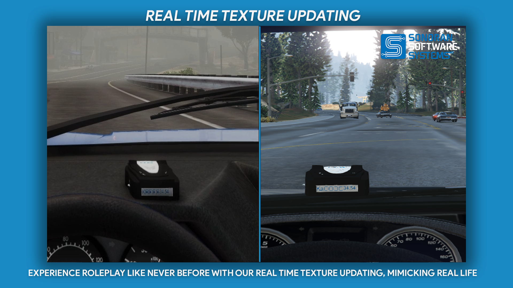
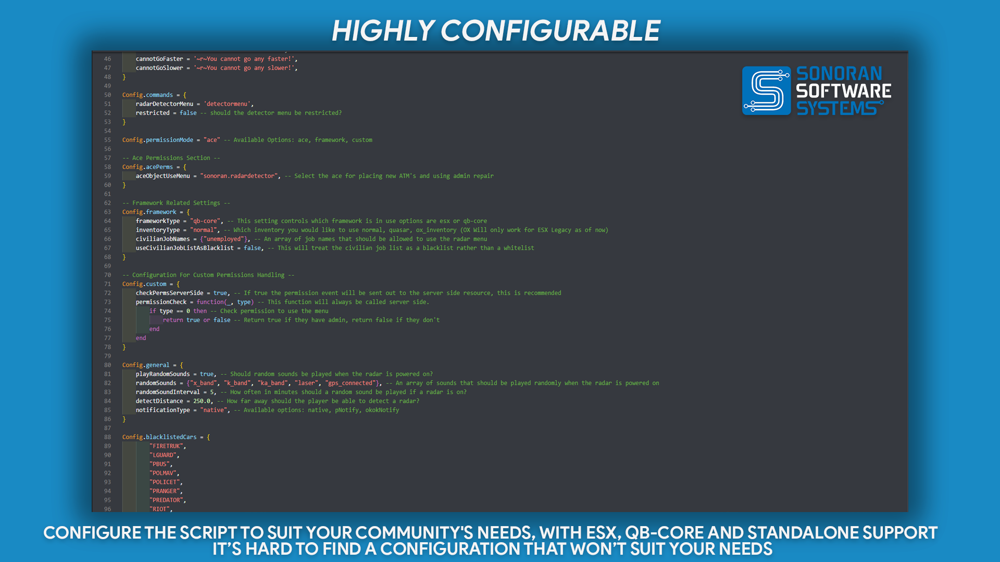

# 📶 Radar Detector / Jammer

<figure><figcaption>
Sonoran Software - Radar Detector Promotional Image
</figcaption></figure>


Sonoran Software - Radar Detector Promotional Video


## Radar Detector / Jammer

### Features

* Ability to operate standalone    &#x20;

<figure><figcaption>
Sonoran Software - Radar Detector Promotional Image
</figcaption></figure>

<figure><figcaption>
Sonoran Software - Radar Detector Promotional Image
</figcaption></figure>

<figure><figcaption>
Sonoran Software - Radar Detector Promotional Image
</figcaption></figure>

<figure><figcaption>
Sonoran Software - Radar Detector Promotional Image
</figcaption></figure>

<figure><figcaption>
Sonoran Software - Radar Detector Promotional Image
</figcaption></figure>

### Changelog

**v1.0.3**

* `feat: Framework garage persistence`
  * Vehicles equipped with radar detectors will now retain their exact detector placement when stored and retrieved from your garage in QBCore or QBox. Simply park the vehicle, store it, and when you take it back out, your radar detector will be restored exactly as you configured it—ready to hit the road instantly.

**v.1.0.2**

* `fix: jQuery script source leading to some users encountering a Mixed Sources error in their client console`

**v1.0.1**

* `feat: Add in Luxart Pro Laser 4 Integration`

[**Luxart Pro Laser 4**](https://forum.cfx.re/t/luxart-pro-laser-4-lidar-resource/5081806)

**v1.0.0**

* `Initial Release`
