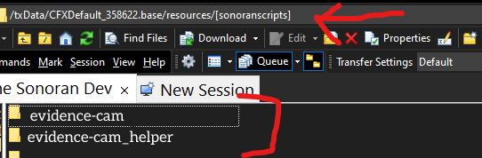
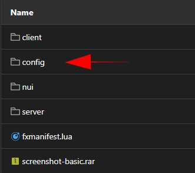

# Getting Started

## Acquire the Script

After purchasing the script through the sonoran store you may [download the script through the keymaster account](../../tebex-assets/) that purchased the script. Upon downloading extract the file to a safe place.

## Install the Script

1.  Inside the script package you just extracted will be two folders. Copy both to a folder in your server's resources folder called `[sonoranscripts]`. Note the brackets `[]` in the name, without them it will not work.&#x20;

    <figure><figcaption><p>Sonoran Software - Evidence Camera - Folders</p></figcaption></figure>
2. In the `evidence-cam/config` folder there will be a file called `config.CHANGEME.lua` you should rename that to be `config.lua` and configure the settings inside as you would like them to be configured based on the configuration documentation below. In that same folder will also be a file called `photos.CHANGEME.json` which is a storage file for all photos that are take and "printed". Change the name to `photos.json`. You will also find a file called `discord.CHANGEME.lua`, this will contain your needed Discord Webhook configuration, but will protect it from any client side dumps. Change this file name to `discord.lua`.


Only ever change the name of the `photos.json` **ON INSTALL**, not on subsequent updates!





**QBCore** Specific - Please follow `Step 3` to ensure inventory items have correct photos!


3. Drag the `cam.png` from `\sonoran-evidececam\config` into the following folder: `\resources\[qb]\qb-inventory\html\images`


**ESX Specific** Specific - Please follow `Step 4` to ensure inventory items work!


4.  a.) Import the `ESX Installme.sql` file into your ESX database

    _**If NOT using**** ****`ox_inventory`**** ****continue to step 5**_

    b.) Add the following code to the `/ox_inventory/data/items.lua` file

    ```lua
    	['sonoran_evidence_camera'] = {
     	label = 'evidence camera',
     	weight = 1,
     	stack = true,
     	close = true,
     	description = nil
     },
     ['sonoran_evidence_photo'] = {
     	label = 'Evidence Photo',
     	weight = 1,
     	stack = true,
     	close = true,
     	description = 'A sweet polaroid',
     	image_link = nil,
     	server = {
     		export = 'sonoran-evidencecam.sonoran_evidence_photo'
     	}
     },
    ```
5. Finally, in your `server.cfg` add the following:


**NEVER** add `ensure evidence-cam_helper` or `ensure [sonoranscripts]` to your server.cfg as this will lead to crashing under specific conditions.


```
ensure screenshot-basic
ensure evidence-cam

add_ace resource.evidence-cam command allow
add_ace resource.evidence-cam_helper command allow
```


Congrats! You have successfully installed Sonoran Evidence Camera. See the next section for configuration options.


## Configuration

### General

| Config Option | Option Description               | Possible Values   |
| ------------- | -------------------------------- | ----------------- |
| `command`     | The command to toggle the camera | `string`          |
| `use_prop`    | Use the camera prop              | `true` or `false` |
| `use_flash`   | Make the camera prop flash       | `true` or `false` |

### Discord

| Config Option      | Option Description                   | Possible Values   |
| ------------------ | ------------------------------------ | ----------------- |
| `use_discord`      | Send webhooks to Discord             | `true` or `false` |
| `internal_log_url` | Webhook URL to send internal logs to | `url`             |
| `public_log_url`   | Webhook URL to send public logs to   | `url`             |

### Frameworks

| Config Option          | Option Description                                             | Possible Values   |
| ---------------------- | -------------------------------------------------------------- | ----------------- |
| `use_esx`              | Use the ESX framework                                          | `true` or `false` |
| `use_esx_ox_inventory` | Utilize OX Inventory for ESX                                   | `true` or `false` |
| `use_custom_inventory` | Use your own custom inventory handling (See dev docs for more) | `true` or `false` |
| `use_qbcore`           | Use the QBCore framework                                       | `true` or `false` |

### CAD

| Config Option | Option Description                   | Possible Values   |
| ------------- | ------------------------------------ | ----------------- |
| `use_cad`     | Link with Sonoran CAD to send photos | `true` or `false` |

### Objects

| Framework | Object | Object Name              |
| --------- | ------ | ------------------------ |
| `QB Core` | Camera | `sonoran_evidencecam`    |
| `QB Core` | Photo  | `sonoran_evidence_photo` |
| `ESX`     | Camera | `sonoran_evidence_cam`   |
| `ESX`     | Photo  | `sonoran_evidence_photo` |
