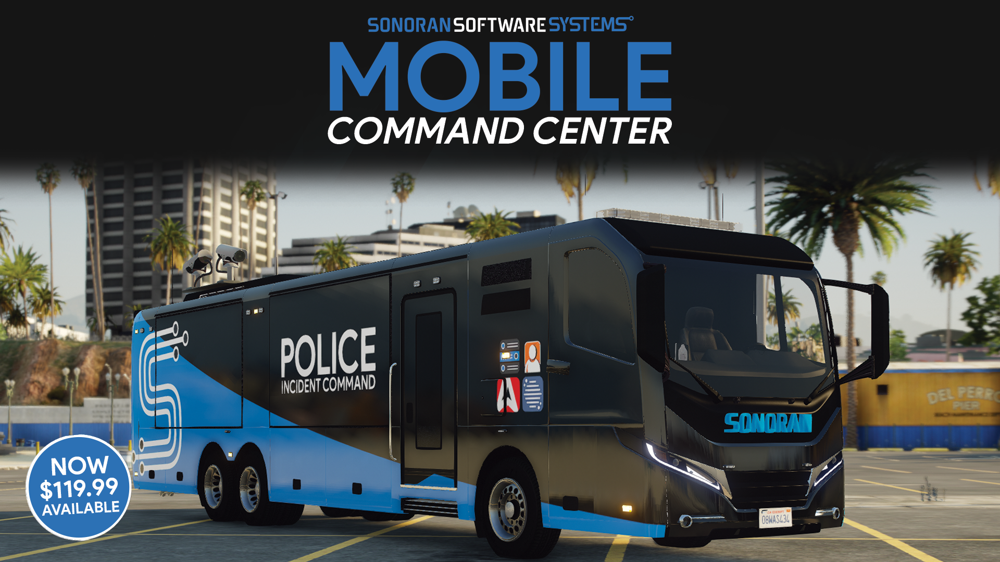
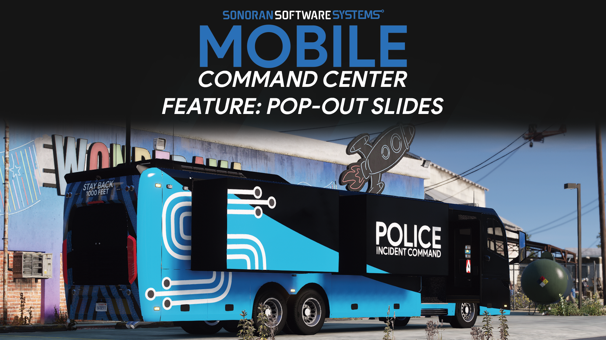
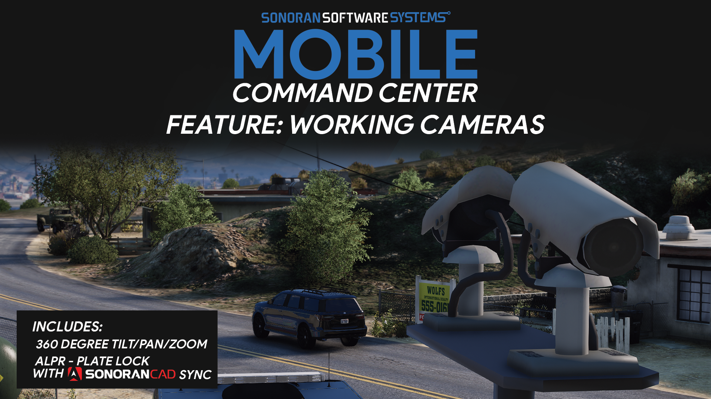
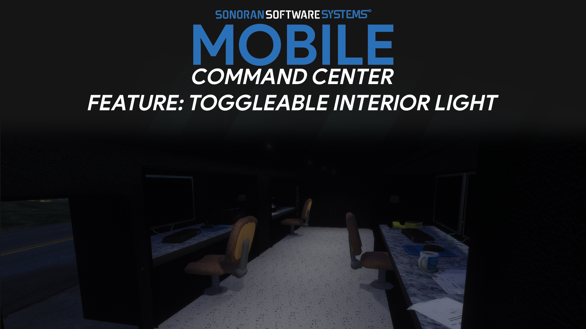
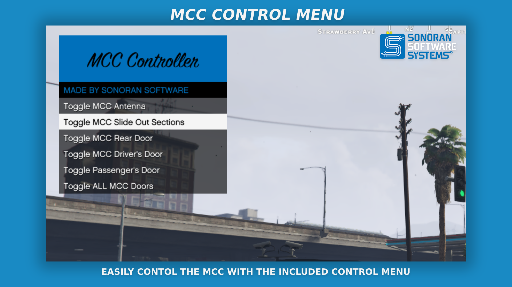
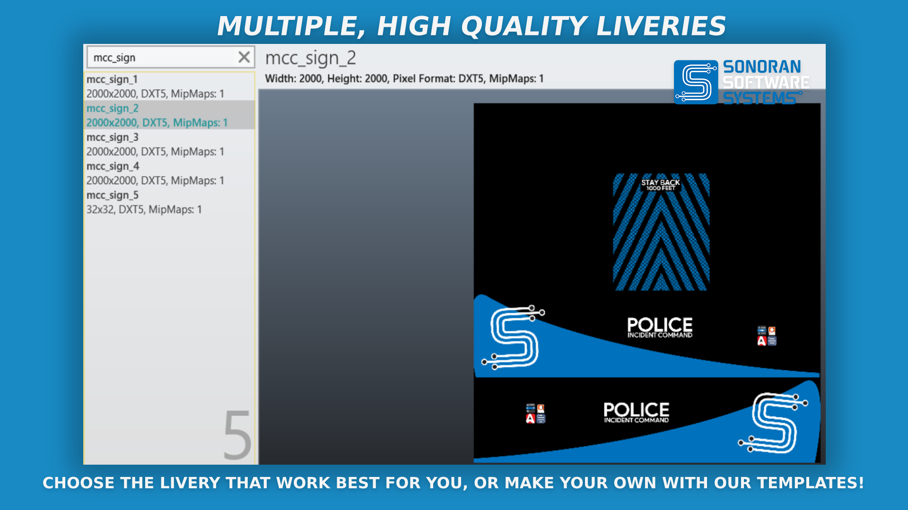
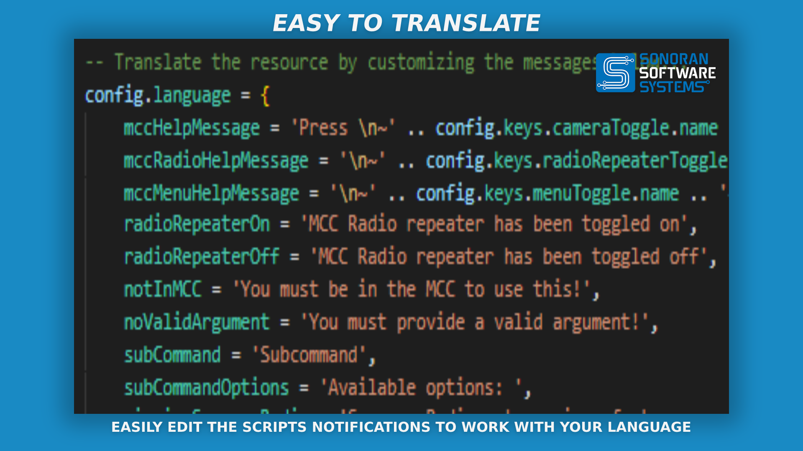

# 🚛 Mobile Command Center

<figure><figcaption>
Sonoran Software - MCC Promotional Image
</figcaption></figure>


Sonoran Software - MCC Promotional Video


## Mobile Command Center

* Ability to operate standalone       &#x20;

<figure><figcaption>
Sonoran Software - MCC Promotional Image
</figcaption></figure>

<figure><figcaption>
Sonoran Software - MCC Promotional Image
</figcaption></figure>

<figure><figcaption>
Sonoran Software - MCC Promotional Image
</figcaption></figure>

<figure><figcaption>
Sonoran Software - MCC Promotional Image
</figcaption></figure>

<figure><figcaption>
Sonoran Software - MCC Promotional Image
</figcaption></figure>

<figure><figcaption>
Sonoran Software - MCC Promotional Image
</figcaption></figure>

<figure><figcaption>
Sonoran Software - MCC Promotional Image
</figcaption></figure>

<figure><figcaption>
Sonoran Software - MCC Promotional Image
</figcaption></figure>

### Metrics

#### File Sizes

| File Name        | File Size |
| ---------------- | --------- |
| `sonomcc.ytd`    | 5,685 KB  |
| `sonomcc.yft`    | 4,800 KB  |
| `sonomcc_hi.yft` | 5,273 KB  |
| `sonomcc+hi.yft` | 702KB     |

#### LODs

This model does include LODs. Counts are as follows, in polygons:

| LOD  | Count   |
| ---- | ------- |
| `L0` | 169,896 |
| `L1` | 100,962 |
| `L2` | 47,662  |
| `L3` | 22,761  |
| `L4` | 272     |

### Changelog

#### v1.0.2

**Bug Fixes**

* `chore: remove JQuery from HTML files`

#### v1.0.1

**Bug Fixes**

* `fix: config variable capitalization`
* `fix: updater overriding meta files`

#### v1.0.0 - Public Release

**Features**

* `feat: include lighting template in resource root`
* `feat: config toggles for radio repeater and repeater range`
* `feat: notification when toggling interior lights`
* `feat: add sonorancad ALPR integration`

**Bug Fixes**

* `fix: texture issues with rear door`

#### v0.9.6

**Features**

* `Added ALPR`

**Bug Fixes**

* `Fixed more menu bugs`

#### v0.9.5

**Features**

* `Added camera zoom`
* `Added error message when trying to use cams w/ antenna down`
* `Added emergency brake`
* `Added new liveries`

**Bug Fixes**

* `Fixed menu bugs`
* `Fixed livery scale bugs`

#### v0.9.1

**Bug Fixes**

* `Fix auto-updater bugs`

#### v0.9.0 - Beta Release

* `Initial Beta Release`
