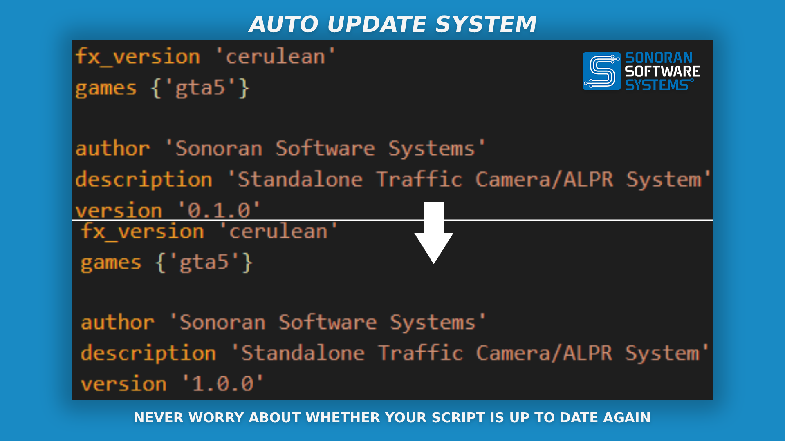

# ⚡ Power Grid

<figure><figcaption>
Sonoran Software - Power Grid Promotional Image
</figcaption></figure>

[Watch the promotional video here!](https://youtu.be/3JhmcqlOWv8)

## Power Grid

### Features

* Ability to operate standalone
* Support for AcePerms, ESX, QBCore, and custom permissions systems        &#x20;

<figure><figcaption>
Sonoran Software - Power Grid Promotional Image
</figcaption></figure>

<figure><figcaption>
Sonoran Software - Power Grid Promotional Image
</figcaption></figure>

<figure><figcaption>
Sonoran Software - Power Grid Promotional Image
</figcaption></figure>

<figure><figcaption>
Sonoran Software - Power Grid Promotional Image
</figcaption></figure>

<figure><figcaption>
Sonoran Software - Power Grid Promotional Image
</figcaption></figure>

<figure><figcaption>
Sonoran Software - Power Grid Promotional Image
</figcaption></figure>

<figure><figcaption>
Sonoran Software - Power Grid Promotional Image
</figcaption></figure>

<figure><figcaption>
Sonoran Software - Power Grid Promotional Image
</figcaption></figure>

<figure><figcaption>
Sonoran Software - Power Grid Promotional Image
</figcaption></figure>

### Commands

These are the default names of commands, they may have been modified by the server owner.

<table><thead><tr><th>Command Name</th><th width="298.3333333333333">Command Description</th><th>Required Permission</th></tr></thead><tbody><tr><td><code>/spawnnewsystem [prop] [name]</code></td><td>This command will allow an admin to spawn a new power system using a gun placement system where the name argument is the label for the new power system and the prop argument is the text name of the model to use</td><td>Admin or as configured</td></tr><tr><td><code>/cancelsystemplacement</code></td><td>This command will cancel the current power system placement if one is currently in progress.</td><td>N/A</td></tr><tr><td><code>/showsystemids</code></td><td>This command will draw the ID of power systems which you are close to with 3D text near the base of the power system</td><td>N/A</td></tr><tr><td><code>/getpositiondata [system id]</code></td><td>This command will print the current positional data of the power system to the chat</td><td>Admin or as configured</td></tr><tr><td><code>/changesystemdata [system data] [position data type] [value]</code></td><td>This command will change the value which you specify of the power system you specify, run this command without arguments for example usage. All changes made with this command will be immediately saved</td><td>Admin or as configured</td></tr><tr><td><code>/reloadpowersystems</code></td><td>This command will completely reload the systems.json from the server's storage</td><td>Admin or as configured</td></tr><tr><td><code>/pslink [system id]</code></td><td>This command will allow the admin to link a power system to a different system using a system similar to the gun placement system</td><td>Admin or as configured</td></tr><tr><td><code>/cancelpslink</code></td><td>This command will cancel the current link in progress</td><td>N/A</td></tr></tbody></table>

### Model Options

&#x20;The model on the left is named `prop_street_light_solar_panel` and the model is named `prop_powerbox`.

<figure><figcaption>
Sonoran Software - Power Grid Promotional Image
</figcaption></figure>

### Changelog

#### v1.0.9

#### Hotpatch

* `Add restart handling to prevent crashing`

#### v1.0.7

#### Feature

* `Add color indicators to hacking mini game. Green numbers mean both the number entered is correct and in the correct position. Red numbers mean the number is either incorrect or not in the correct position`

#### v1.0.3

* `Includes a possible fix for higher than normal server timings on player join for certain ESX configurations`

#### v1.0.1

* `Fixed: discord.CHANGEME.lua file added to escrowignore (required config file for configuring discord webhooks)`

#### v1.0.0

* `Initial Release`
