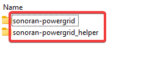
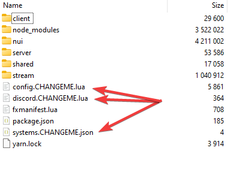

# Getting Started

## Acquire the Script

After purchasing the script through the sonoran store you may [download the script through the keymaster account](../../tebex-assets/) that purchased the script. Upon downloading extract the file to a safe place.

## Install the Script

1.  Inside the script package you just extracted will be two folders. Copy both to a folder in your server's resources folder called `[sonoranscripts]` note the `[]` in the name, without them it will not work.&#x20;

    <figure><figcaption><p>Sonoran Software - Power Grid - Folders</p></figcaption></figure>
2. In the `sonoran-powergrid` folder are three files you must change and configure:&#x20;
   1. `config.CHANGEME.lua` needs to be renamed to `config.lua`&#x20;
   2. `discord.CHANGEME.lua` renamed to `discord.lua`&#x20;
   3. And finally `systems.CHANGEME.json` renamed to `systems.json`.

<figure><figcaption><p>Sonoran Software - Power Grid - Remove .CHANGEMEs</p></figcaption></figure>

3. You can open and edit the `config.lua` file to change the settings for the power grid script. You can also edit the `discord.lua` file to add discord webhook updates for when the state of the power grid changes. For more advanced users, you can add custom power grid stations in the `systems.json` file by following the template
4. Finally, in your `server.cfg` add the following:

```
ensure sonoran-powergrid

add_ace resource.sonoran-powergrid command allow
add_ace resource.sonoran-powergrid_helper command allow
```

## Configuring the Script


This script utilizes two separate Lua configs. This is for security reasons. Having a separate config for your Discord Configuration keeps them server side only and safer from malicious clients.



<details>

<summary>Default <code>config.lua</code></summary>

```lua
Config = {}

-- General Configuration Section --
Config.configuration_version = 1.0
Config.debug_mode = false -- Only useful for developers and if support asks you to enable it
Config.permission_mode = "ace" -- Available Options: ace, framework, custom

-- Ace Permissions Section --
Config.ace_perms = {
    ace_object_place = "sonoran.powersystems", -- Select the ace for placing new power systems and using admin repair
    ace_object_notification = "sonoran.police", -- Select the ace for receiving in-game notifications
    ace_object_can_hack = "sonoran.hacker", -- Select the ace for being allowed to hack power systems
    ace_object_can_repair = "sonoran.repairman" -- Select the ace for being allowed to repair power systems
}

-- Framework Related Settings --
Config.framework = {
    framework_type = "qb-core", -- This setting controls which framework is in use options are esx or qb-core
    police_job_names = {"police"}, -- An array of job names that should receive notifications
    allowed_to_place_groups = {"admin"}, -- The permission group that should be allowed to place new systems
    hacker_job_names = {"unemployed", "banker", "it"}, -- An array of job names that should receive notification_message
    repairman_job_names = {"repairman"}, -- An array of job names that should receive notifications
    use_hacker_job_list_as_blacklist = false -- This will treat the hacker job list as a blacklist rather than a whitelist
}

-- Configuration For Custom Permissions Handling --
Config.custom = {
    check_perms_server_side = true, -- If true the permission event will be sent out to the server side resource, this is recommended
    permissionCheck = function(source, type) -- This function will always be called server side.
        if type == 0 then -- Check for admin
            return true or false -- Return true if they have admin, return false if they don't
        elseif type == 1 then -- Check for notification perms
            return true or false -- Return true if they have permissions, return false if they don't
        elseif type == 2 then -- Check for hacker perms
            return true or false -- Return true if they have permissions, return false if they don't
        elseif type == 3 then -- Check for repair perms
            return true or false -- Return true if they have permissions, return false if they don't
        end
    end
}

-- Choose Custom Command Names --
Config.command_names = {
    spawn_new_system = "spawnnewsystem",
    cancel_new_spawn = "cancelsystemplacement",
    position_debug_display = "showdebugposition",
    upload_client_log = "uploadpowerclientlogs",
    upload_server_log = "uploadpowerserverlogs",
    show_system_id = "showsystemids",
    get_position_data = "getsystemposdata",
    change_position_data = "changesystemdata",
    reload_systems = "reloadpowersystems",
    cancel_new_link = "cancelpslink",
    start_new_link = "pslink"
}

Config.power_system_settings = {
    show_system_blips_for_police = false
}

-- Feature Settings That Don't Require Other Resources --
Config.standalone_features = {
    show_notification_blips_for_police = true, -- Should police see a blip when a car is pinged?
    blips_expire_after_seconds = 90, -- Number of seconds before the blip type above is removed
    enable_auto_update = true, -- Should the script automatically update itself, it will check for updates regardless
    notify_on_failed_disable = true, -- Should the script notify police when someone attempts and fails to disable a power system
    use_minigame_for_disable = true, -- Set to false to not require a minigame and enable instant hacking
    notify_on_hack_success = true, -- Set to false to disable notification about successful power system hacks
    delay_for_notifying_successful_hack = 10 -- Time in seconds between a successful hack and notification going out, set to 0 to disable delay
}

--[[
    Placeholder list:
    {{POSTAL}}
    {{EVENT_TYPE}}
    {{SYSTEM_NAME}}
]]

-- Settings For Integrations With Other Resources --
Config.integration = {
    SonoranCAD_integration = {
        use = true, -- Should any of the options below be used? Integration with this script requires at least a Plus subscription.
        add_live_map_blips = true, -- Should blips for the power systems be added to the live map? This requires the Pro SonoranCAD plan
        enable_911_calls = true, -- Should 911 calls be generated in the CAD when a BOLO vehicle or speeder is detected?
        ["911_caller"] = "Automated Powergrid Alerts", -- Who should the 911 call appear to be from?
        ["911_message"] = "{{EVENT_TYPE}} Alert at power system with name {{SYSTEM_NAME}}", -- Configurable 911 call description
        nearest_postal_plugin = "nearest-postal", -- If you want to use postals, what is the exact name of your postals script?
        disable_in_game_with_dispatch = true, -- If true disables in-game notifications when dispatch is online in CAD
        disable_cad_without_dispatch = true -- If true disables CAD notifications when dispatch is offline in CAD
    }
}

-- Notification Settings --
Config.notifications = {
    type = "native", -- Available options: native, pNotify, okokNotify, or cadonly
    notification_title = "{{EVENT_TYPE}}", -- Notification Title for methods that support it
    -- Uncomment line below and comment line 105 if you plan to use pNotify
    -- notification_message = "<b>{{EVENT_TYPE}} Alert</b></br>Power System Name: {{SYSTEM_NAME}}"
    notification_message = "{{EVENT_TYPE}} Alert\nPower System Name: {{SYSTEM_NAME}}", -- The text of the notification
    notification_repaired_title = "Power System Repaired",
    notification_repaired_message = "Power System repaired successfully: {{SYSTEM_NAME}}"
}
```

</details>

<details>

<summary>Default <code>discord.lua</code></summary>

```lua
DiscordConfig = {
    enabled = false, -- Should discord webhooks be used?
    webhook_url = "", -- See https://support.discord.com/hc/en-us/articles/228383668-Intro-to-Webhooks
    webhook_title = "{{EVENT_TYPE}} Alert", -- The title of the webhook embed
    webhook_message = "Power System Name: {{SYSTEM_NAME}}" -- The message that the webhook displays
}
```

</details>

## Setting Up Permissions (Ace Permissions Only)

To use this script you must assign the permissions object to the groups which you would like to have permissions. You can find the objects needed in the config under `Config.ace_perms` section in the config. To assign these perms you must add the lines to your `server.cfg` or where ever you setup permissions on your server. You can learn more about Ace Permissions [here](https://forum.cfx.re/t/basic-aces-principals-overview-guide/90917).

Example:

```lua
add_ace group.admin sonoran.powersystems allow
add_ace group.leo sonoran.police allow
add_ace group.hacker sonoran.hacker allow
add_ace group.moderator sonoran.repairman allow
```

## System Location Config

You have two options for placing new systems:

1. You can use the command `/spawnnewsystem [prop] [name]` to initiate spawning a new system and generate the relevant config data
   * After running this command you must pull out, aim, and shoot with a gun to confirm placement.
   * You may need to modify some of the rotation values manually to get that perfect placement you are looking for.
   * [Click here for more information.](../../general/gun-placement.md)
2. You can manually copy and paste an existing config and then modify the values to meet your needs for the new system

### `systems.json` Property Explanation

| Property Name | Example         | Notes                                                                      |
| ------------- | --------------- | -------------------------------------------------------------------------- |
| `ID`          | 2               | `ID` must be unique. No other power system can share this ID               |
| `Prop`        | `prop_powerbox` | Valid values are `prop_powerbox` and `prop_street_light_solar_panel`       |
| `Position`    |                 | This is a table that contains the x, y, and z coords of the power system   |
| `Rotation`    |                 | This is a table that contains the x, y, and z rotation of the power system |
| `Label`       | `Test 1`        | This is a human readable label for the power system, can have spaces       |
| `Devices`     |                 | This is an table of devices attached to the power grid                     |

## Commands

These are the default names of commands, they may have been modified by the server owner.

| Command Name                                                   | Command Description                                                                                                                                                                                                | Required Permission    |
| -------------------------------------------------------------- | ------------------------------------------------------------------------------------------------------------------------------------------------------------------------------------------------------------------ | ---------------------- |
| `/spawnnewsystem [prop] [name]`                                | This command will allow an admin to spawn a new power system using a gun placement system where the name argument is the label for the new power system and the prop argument is the text name of the model to use | Admin or as configured |
| `/cancelsystemplacement`                                       | This command will cancel the current power system placement if one is currently in progress.                                                                                                                       | N/A                    |
| `/showsystemids`                                               | This command will draw the ID of power systems which you are close to with 3D text near the base of the power system                                                                                               | N/A                    |
| `/getpositiondata [system id]`                                 | This command will print the current positional data of the power system to the chat                                                                                                                                | Admin or as configured |
| `/changesystemdata [system data] [position data type] [value]` | This command will change the value which you specify of the power system you specify, run this command without arguments for example usage. All changes made with this command will be immediately saved           | Admin or as configured |
| `/reloadpowersystems`                                          | This command will completely reload the systems.json from the server's storage                                                                                                                                     | Admin or as configured |
| `/pslink [system id]`                                          | This command will allow the admin to link a power system to a different system using a system similar to the gun placement system                                                                                  | Admin or as configured |
| `/cancelpslink`                                                | This command will cancel the current link in progress                                                                                                                                                              | N/A                    |
