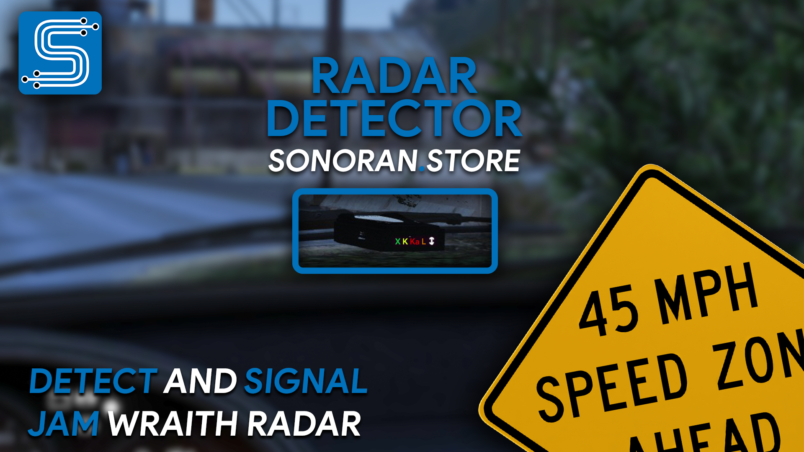
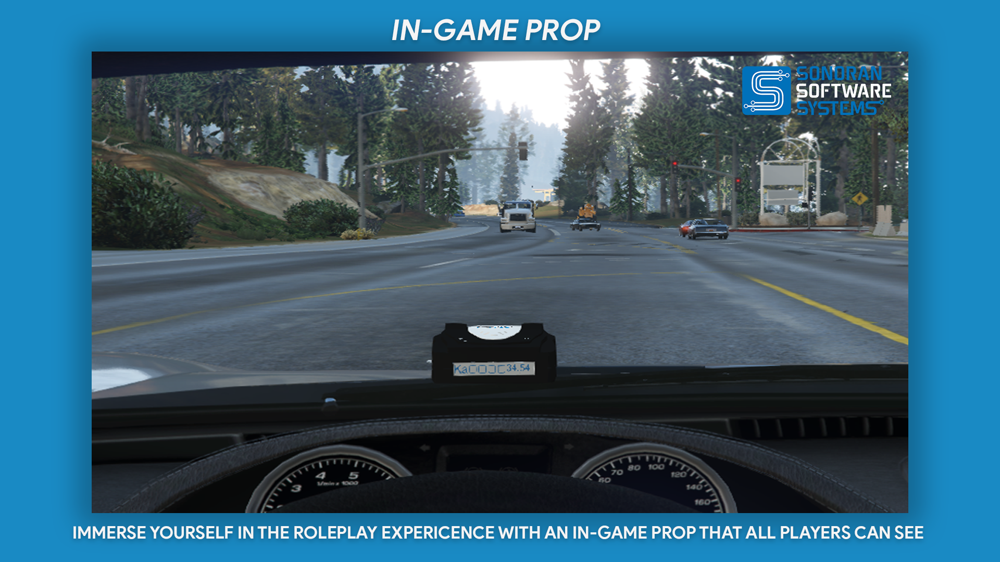
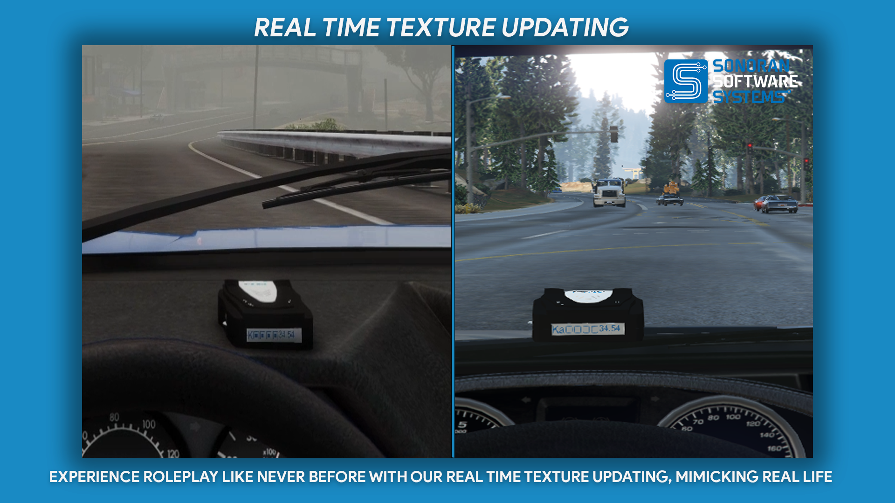
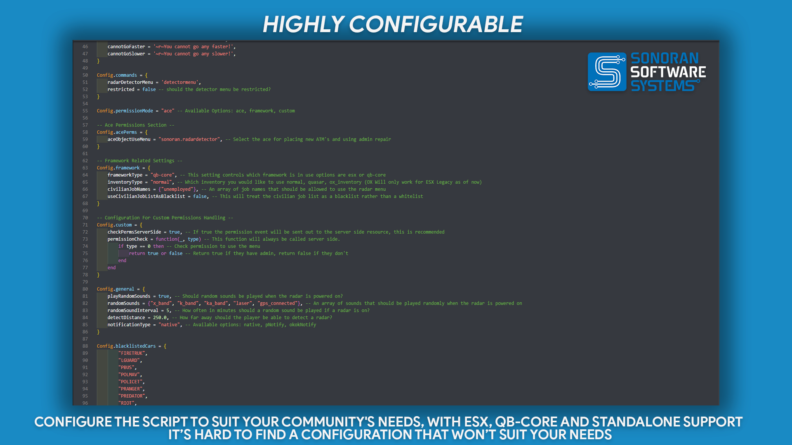

# 📶 Radar Detector / Jammer

<figure><figcaption>
Sonoran Software - Radar Detector Promotional Image
</figcaption></figure>

[Watch the promotional video here!](https://www.youtube.com/watch?v=E3263PAPmfc)

## Radar Detector / Jammer

### Features

* Ability to operate standalone    &#x20;

<figure><figcaption>
Sonoran Software - Radar Detector Promotional Image
</figcaption></figure>

<figure><figcaption>
Sonoran Software - Radar Detector Promotional Image
</figcaption></figure>

<figure><figcaption>
Sonoran Software - Radar Detector Promotional Image
</figcaption></figure>

<figure><figcaption>
Sonoran Software - Radar Detector Promotional Image
</figcaption></figure>

<figure><figcaption>
Sonoran Software - Radar Detector Promotional Image
</figcaption></figure>

### Changelog

**v1.0.1**

* `feat: Add in Luxart Pro Laser 4 Integration`

[**Luxart Pro Laser 4**](https://forum.cfx.re/t/luxart-pro-laser-4-lidar-resource/5081806)

**v1.0.0**

* `Initial Release`
