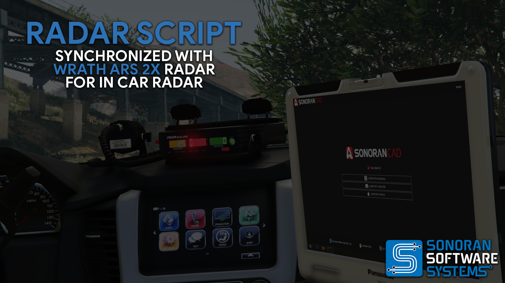
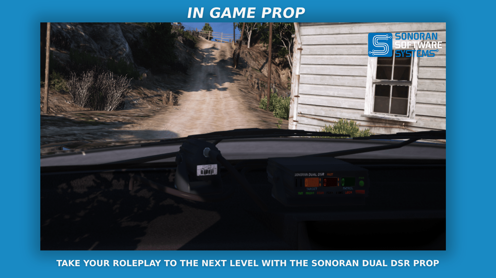
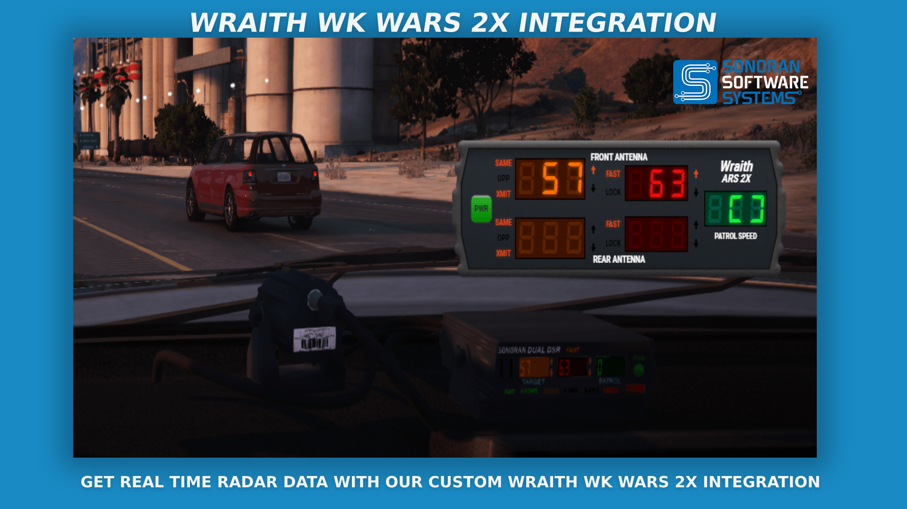
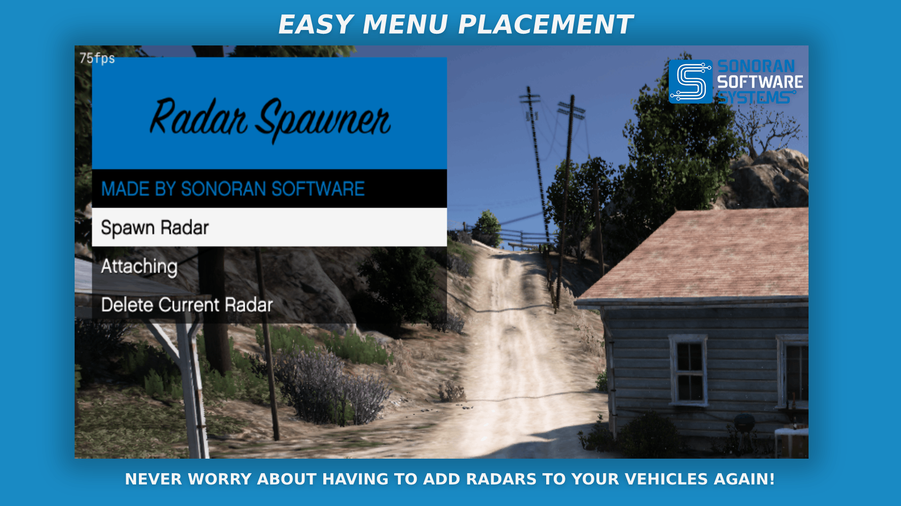
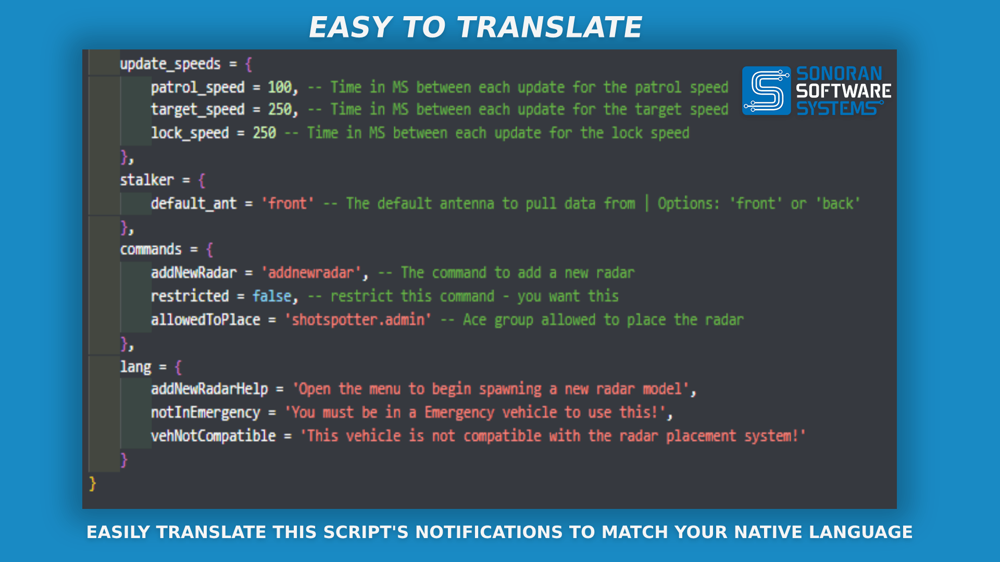
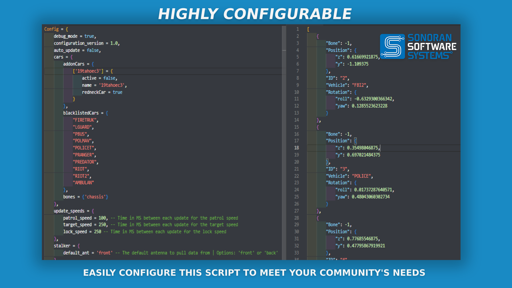

# 📟 Radar Display

<figure><figcaption>
Sonoran Software - Radar Display Promotional Image
</figcaption></figure>


Sonoran Software - Radar Display Promotional Video


## Radar Display

### Features

* Ability to operate standalone     &#x20;

<figure><figcaption>
Sonoran Software - Radar Display Promotional Image
</figcaption></figure>

<figure><figcaption>
Sonoran Software - Radar Display Promotional Image
</figcaption></figure>

<figure><figcaption>
Sonoran Software - Radar Display Promotional Image
</figcaption></figure>

<figure><figcaption>
Sonoran Software - Radar Display Promotional Image
</figcaption></figure>

<figure><figcaption>
Sonoran Software - Radar Display Promotional Image
</figcaption></figure>

<figure><figcaption>
Sonoran Software - Radar Display Promotional Image
</figcaption></figure>

### Changelog

#### v1.0.2

**Hotfix**

* `fix: "attempt to call a nil value (field 'SpawnItem')"`

#### v1.0.1

**Hotfix**

* `fix: Escrow ignore config files`

#### v1.0.0

* `Initial Release`
