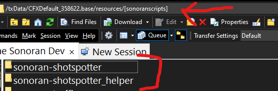
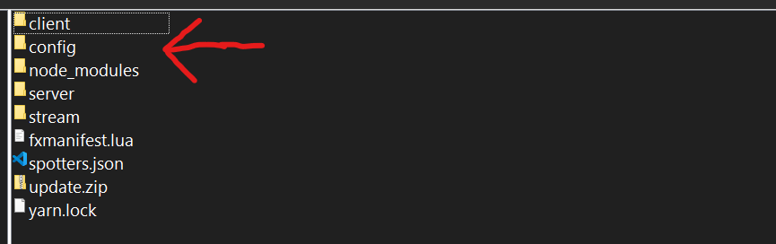
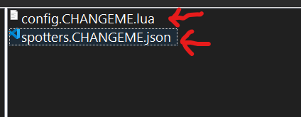

# Getting Started

## Acquire the Script

After purchasing the script through the sonoran store you may [download the script through the keymaster account](../../general/tebex-assets.md) that purchased the script. Upon downloading extract the file to a safe place.

## Install the Script

1.  Inside the script package you just extracted will be two folders. Copy both to a folder in your server's resources folder called `[sonoranscripts]` note the `[]` in the name, without them it will not work.&#x20;

    <figure><figcaption><p>Sonoran Software - Shot Spotter - Folders</p></figcaption></figure>
2.  In the `sonoran-shotspotter/config` folder there will be a file called `config.CHANGEME.lua` you should rename that to be config.lua and configure the settings inside as you would like them to be configured based on the configuration documentation below. In that same folder will also be a file called `spotters.CHANGEME.json` which you should rename to `spotters.json` and use to manually place cameras based on the existing template, note you can also use the gun placement system in game. You will also find a file called `discord.CHANGEME.lua`, this should be named to `discord.lua` &#x20;

    <figure><figcaption><p>Sonoran Software - Shot Spotter - Config Folder</p></figcaption></figure>

    <figure><figcaption><p>Sonoran Software - Shot Spotter - Remove .CHANGEMEs</p></figcaption></figure>
3. Finally, in your `server.cfg` add the following:

```
ensure sonoran-shotspotter

add_ace resource.sonoran-shotspotter command allow
add_ace resource.sonoran-shotspotter_helper command allow
```


**NEVER** add `ensure sonoran-shotspotter_helper` or `ensure [sonoranscripts]` to your server.cfg as this will lead to crashing under specific conditions.



Congrats! You have successfully installed Sonoran Shot Spotter. See below for configuration.


## Configuration



Sonoran Shot Spotter contains highly configurable permissions that have a fit for any server. In this section you will see options for standalone, QB-Core and ESX. Below will detail every option in this section, it's meaning and options.

| Config Option   | Option Description                                                                                                                                                     | Possible Values   |
| --------------- | ---------------------------------------------------------------------------------------------------------------------------------------------------------------------- | ----------------- |
| `restricted`    | Would you like to restrict the `/shotspot` command or allow anyone to use it?                                                                                          | `true` or `false` |
| `use_ace_perms` | Would you like to utilize FiveM Ace Permissions?                                                                                                                       | `true` or `false` |
| `ace_object`    | The ace name that will be used to assign permissions. More can be read about Ace Permissions [Here](https://forum.cfx.re/t/basic-aces-principals-overview-guide/90917) | `string`          |
| `use_esx`       | Would you like to utilize ESX framework jobs for permissions?                                                                                                          | `true` or `false` |
| `police_job`    | What is the name of your ESX jobs that should have access to the shotspotter?                                                                                          | `array`           |
| `admin`         | Admin name for ESX                                                                                                                                                     | `string`          |
| `use_qbcore`    | Would you like to utilize QB-Core framework jobs for permissions?                                                                                                      | `true` or `false` |
| `police_job`    | What is the name of your QB-Core jobs that should have access to the shotspotter?                                                                                      | `array`           |
| `admin`         | Admin name for QBCore                                                                                                                                                  | `string`          |
| `ace_object`    | Ace permission name for admin perms                                                                                                                                    | `string`          |



| Config Option | Option Description                                                   | Possible Values   |
| ------------- | -------------------------------------------------------------------- | ----------------- |
| `onduty_url`  | URL to send OnDuty webhooks to                                       | `string`          |
| `offduty_url` | URL to send OffDuty webhooks to                                      | `string`          |
| `onshot_url`  | URL to send shot webhooks to                                         | `string`          |
| `disabled`    | URL to log toggled shot spotters to                                  | `string`          |
| `onduty`      | Would you like to send a webhook when someone goes on duty?          | `true` or `false` |
| `offduty`     | Would you like to send a webhook when someone goes off duty?         | `true` or `false` |
| `onshot`      | Would you like to send a webhook when the shot spotter is triggered? | `true` or `false` |



| Config Option         | Option Description                                                                                  | Possible Values   |
| --------------------- | --------------------------------------------------------------------------------------------------- | ----------------- |
| `use_auto_detect`     | Ignore spotter locations and radius                                                                 | `true` or `false` |
| `auto_update`         | Auto update the script                                                                              | `true` or `false` |
| `use_cad`             | Would you like to utilize the Sonoran Cad framework to automatically send 911 calls to Sonoran Cad? | `true` or `false` |
| `use_cad`             | Would you like to utilize the Sonoran Cad livemap?                                                  | `true` or `false` |
| `check_dispatch`      | Check if a dispatcher is online before sending a 911 call                                           | `true` or `false` |
| `use_network_latency` | Add a random delay to calls                                                                         | `true` or `false` |
| `network_time`        | Max time to wait                                                                                    | `integer`         |
| `notif`               | Which notification system would you like to use                                                     |                   |
| `use_command`         | Would you like to be able to toggle the shot spotter alerts in game on and off?                     | `true` or `false` |
| `shotspot_cmd`        | The command to toggle the shot spotter alerts in game                                               | `string`          |
| `show_on_map`         | Would you like to show a blip on the map when the shot spotter was triggered?                       | `true` or `false` |
| `radius`              | How large of a radius should each shot spotter scan?                                                | `integer`         |



| Config Option | Option Description                                            | Possible Values             |
| ------------- | ------------------------------------------------------------- | --------------------------- |
| `use_object`  | Would you like to utilize the included shot spotter object?   | `true` or `false`           |
| `cooldown`    | How long of a cooldown should be between shot spotter alerts? | `integer` (time in seconds) |



| Config Option | Option Description                             | Possible Values |
| ------------- | ---------------------------------------------- | --------------- |
| `peds`        | Peds that will not trigger the shot spotter    | `array`         |
| `weapons`     | Weapons that will not trigger the shot spotter | `array`         |



### Lang

The language section was created to make the script as universal as possible. Please simply edit the strings to your preferred text.

#### Note: Available place holders are \{{street\}}, \{{spotter\}} and \{{player\}}


Congrats! You have successfully configured Sonoran Shot Spotter. See below for spotter locations.


## Spotter Locations


For shot spotters mounted to a pole (such as traffic lights), if the pole is broken, the shot spotter will be disabled.


These locations can be found and set in the `spotters.json` found within the `config` folder. To configure spotters follow this chart:

| Config Option          | Option Description                    | Possible Values | Notes                     |
| ---------------------- | ------------------------------------- | --------------- | ------------------------- |
| `ID`                   | The shot spotter ID (used internally) | `integer`       | This cannot be duplicated |
| `x`, `y`, `z`          | The in game coordinates               | `integer`       | N/A                       |
| `pitch`, `roll`, `yaw` | Rotation values                       | `integer`       | N/A                       |

## Commands

| Command Name          | Command Description                                                                                                 | Required Permission  |
| --------------------- | ------------------------------------------------------------------------------------------------------------------- | -------------------- |
| `/shotspot`           | This command will toggle the user's shot spotter status, either enabling or disabling shot spotter alerts and blips | LEO or as configured |
| `/showspotterid`      | Show the ID above the shot spotters                                                                                 | Admin                |
| `/showspotterpos`     | Show the position of the shot spotters                                                                              | Admin                |
| `/changepositiondata` | Change the position data of the shot spotter                                                                        | Admin                |
| `/reloadspotters`     | Reload all spotters and positions                                                                                   | Admin                |
| `/spawnnewspotter`    | Activate the placement gun                                                                                          | Admin                |
