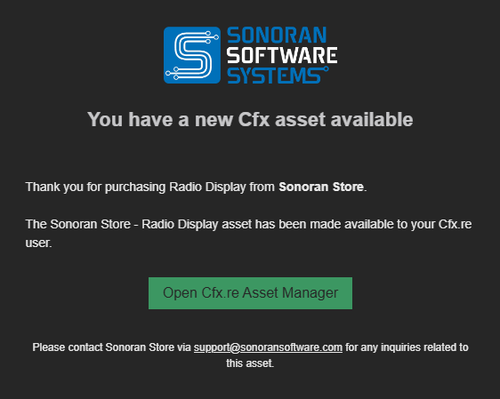

# 🦺 Sonoran Safety Vests

## Add visibility and movement to your EUP outfits

Give your characters a more practical, polished look with Sonoran Safety Vests. These EUP accessories are designed to fit naturally into public-safety, roadside, construction, event, and civilian roleplay outfits while moving with the player in-game.

<figure><figcaption></figcaption></figure>

## Built to move

The Safety Vests use physics-enabled movement so the vest responds naturally as the player walks, runs, turns, and moves through the world. This adds a more convincing finishing detail to uniforms and high-visibility outfits.

<figure><figcaption></figcaption></figure>

## Designed for roleplay

Safety Vests are a natural fit for:

* Police, sheriff, and other public-safety uniforms
* Fire, EMS, and roadside-response outfits
* Construction and utility workers
* Event staff and security personnel
* Civilian and high-visibility clothing
* Custom EUP collections and department loadouts

<figure><figcaption></figcaption></figure>

## Product details

| Feature       | Details                                            |
| ------------- | -------------------------------------------------- |
| Item type     | EUP safety vest accessory                          |
| Movement      | Moves naturally with your character                |
| Compatibility | Optimized for FiveM EUP / vMenu clothing workflows |
| Variants      | 2 Colors, 4 Textures (clean and dirty)             |
| Positions     | 1 Position                                         |
| Textures      | 4 textures                                         |
| Polygons      | 1,740 polygons                                     |
| Performance   | Optimized for FiveM                                |

<figure><figcaption></figcaption></figure>

## In-game location

The Safety Vests are accessed through vMenu's EUP clothing options.

1. Open **vMenu**.
2. Open the **EUP / Player Appearance** clothing menu.
3. Open **Shirt and Accessory**.
4. Scroll all the way to the end of the category and select slot **217**.
5. Select a vest and use the texture/variation controls to preview the available options.

## Simple installation

Download the ZIP from the Cfx.re Portal, unzip it, place the `sonoran-safety-vests` folder in your server's `resources` directory, and add it to `server.cfg`:

```cfg
ensure sonoran-safety-vests
```

For the complete installation process, screenshot placeholders, and EUP streamed-asset troubleshooting, see:


[installation.md](installation.md)

