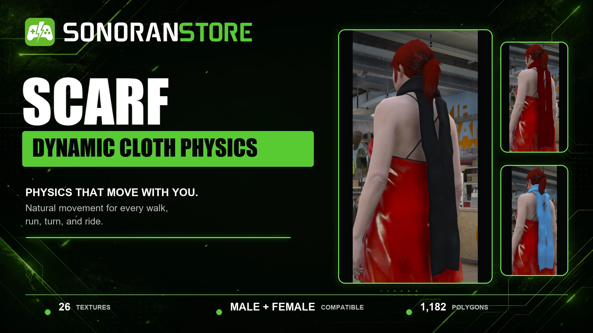
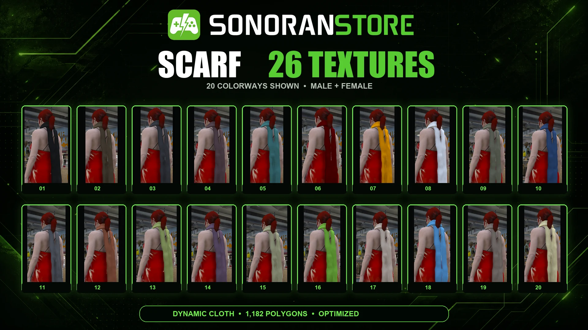
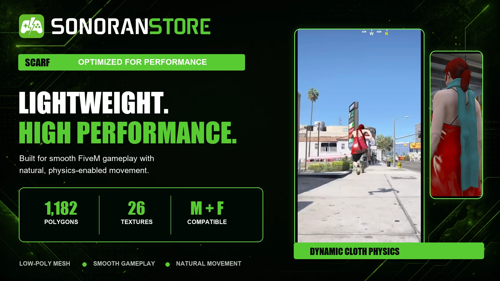

# 🧣 Scarf

## A finishing layer that moves naturally


This EUP asset is escrow protected by Tebex. [Learn more about what this means.](installation.md#texture-customization)


Finish any outfit with the Sonoran Scarf, a lightweight FiveM clothing
accessory built to add natural fabric movement to civilian, formal, seasonal,
and custom EUP looks. It supports both male and female characters and includes
26 textures for flexible styling.

<figure><figcaption><p>Sonoran Scarf with dynamic cloth physics</p></figcaption></figure>

## Made to move

Dynamic cloth physics let the scarf respond as the character walks, runs,
turns, and rides. The long fabric panels move with the player instead of
remaining rigid, giving outfits a more convincing finishing detail.

## Product details

| Feature       | Details                                      |
| ------------- | -------------------------------------------- |
| Style         | Long neck scarf                              |
| Movement      | Dynamic cloth physics                        |
| Compatibility | Male and female FiveM EUP / vMenu workflows  |
| Textures      | 26 textures                                  |
| Polygons      | 1,182 polygons                               |
| Performance   | Optimized for FiveM                          |

<figure><figcaption><p>26 included textures, with 20 supplied color previews shown</p></figcaption></figure>

## Built for character customization

The Scarf is a flexible addition to:

* Civilian and streetwear outfits
* Business and formal looks
* Winter and seasonal clothing
* Gang, crew, and color-coordinated outfits
* Custom male and female EUP collections

<figure><figcaption><p>Lightweight geometry with physics-enabled movement</p></figcaption></figure>

## In-game location

1. Open **vMenu**.
2. Open **Player Appearance**.
3. Select the clothing category for **Neck and Scarves** or accessories.
4. Scroll to the end of the category.
5. Select the Sonoran Scarf.
6. Use the texture/variation controls to preview all 26 textures.


The exact category label can vary with the vMenu version and other installed EUP
resources. The Scarf is streamed in the neck/accessory clothing component and
appears at the end of that component's available items.


## Simple installation

Download the ZIP from the Cfx.re Portal, unzip the inner package if necessary,
place `sonoran-scarf` in the server's `resources` directory, and add the
resource to `server.cfg`.

```cfg
ensure sonoran-scarf
```

For the complete installation process, EUP streamed-asset troubleshooting, and
texture-customization notes, see:


[installation.md](installation.md)

