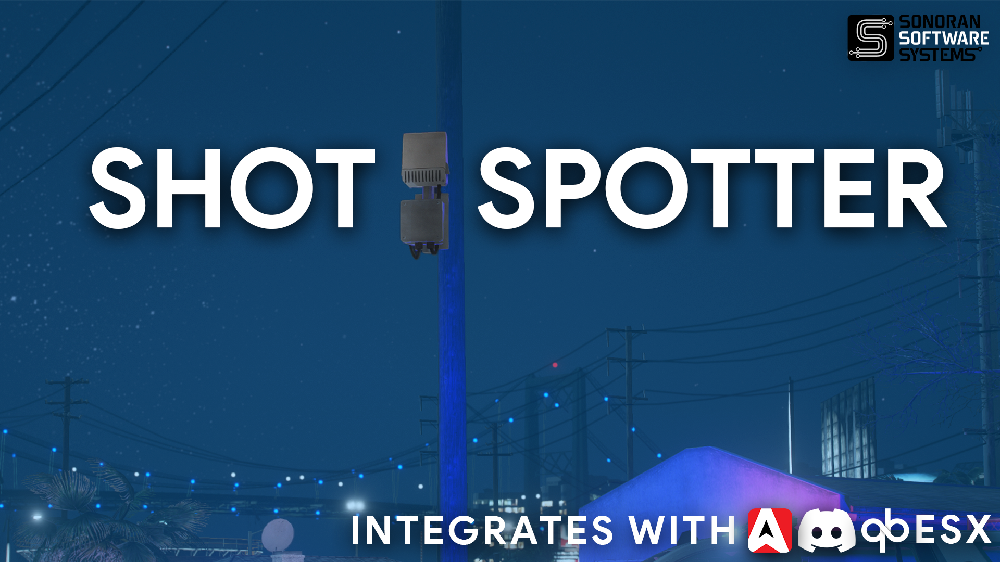
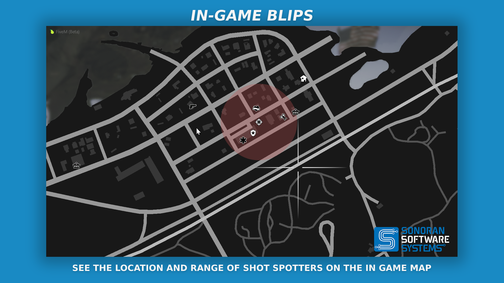
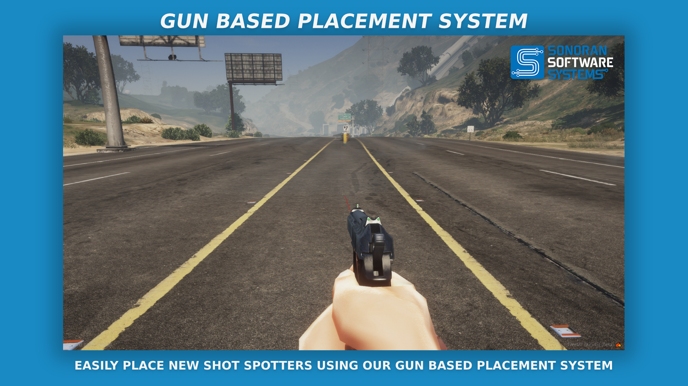

# 🔫 Shot Spotter


Sonoran Software - Shot Spotter Promotional Video


## Shot Spotter

### Features

* Ability to operate standalone
* Support for AcePerms, ESX, QBCore, and custom permissions systems

<figure><figcaption>
Sonoran Software - Shot Spotter Promotional Image
</figcaption></figure>

<figure><figcaption>
Sonoran Software - Shot Spotter Promotional Image
</figcaption></figure>

<figure><figcaption>
Sonoran Software - Shot Spotter Promotional Image
</figcaption></figure>

<figure><figcaption>
Sonoran Software - Shot Spotter Promotional Image
</figcaption></figure>

<figure><figcaption>
Sonoran Software - Shot Spotter Promotional Image
</figcaption></figure>

<figure><figcaption>
Sonoran Software - Shot Spotter Promotional Image
</figcaption></figure>

### Commands

| Command Name              | Command Description                                                                                                 | Required Permission  |
| ------------------------- | ------------------------------------------------------------------------------------------------------------------- | -------------------- |
| `/shotspot`               | This command will toggle the user's shot spotter status, either enabling or disabling shot spotter alerts and blips | LEO or as configured |
| `/showspotterid`          | Show the ID above the shot spotters                                                                                 | Admin                |
| `/showspotterpos`         | Show the position of the shot spotters                                                                              | Admin                |
| `/changepositiondata`     | Change the position data of the shot spotter                                                                        | Admin                |
| `/reloadspotters`         | Reload all spotters and positions                                                                                   | Admin                |
| `/spawnnewspotter`        | Activate the placement gun [SEE HERE](../general/gun-placement.md)                                                  | Admin                |
| `/cancelspotterplacement` | Cancels the placement gun                                                                                           | Admin                |
| `togglespotter`           | Toggle the spotter with the specified ID                                                                            | Admin                |

### Changelog

#### v1.3.1

**Bug Fix**

* `Fixed "TRIGGER_CLIENT_INTERNAL" bug on player joining`

#### v1.3.0

**Feature**

* `Add postals to shot spotter 911 calls`

#### v1.2.9

**Improvements**

* `Handle pole breaking and disabling of spotters`

#### v1.2.8

**Hotpatch**

* `Add restart handling to prevent crashing`

#### v1.2.6

**Bug Fixes**

* `Fixed bug creating multiple 911 calls for single shooting event`
* `Fixed blips not going away when toggling off shot spotting`
* `Fixed core shot spotter not sending alerts to ALL on duty officers`
* `Fixed core shot spotter sending alerts to shooting source`

**Refactor**

* `Added discord.lua config file for security`
* `Removed Discord configuration from config.lua for security`
* `Update FxManifest.lua to only pass discord.lua to server side`
* `Revamped config.lua file (See key changes below)`
* `Move Utilities to shared scripts`
* `Optimize CAD API calls`
* `Remove reduntant/ unused loops and threads`

**`config.lua` Changes**

* `Moved network_latency, notifications, commands, check_dispatch to standalone sections`
* `Changed notifications.type to be string | Available types: native, pNotify, okokNotify`
* `Remove all Discord options`
* `Bump version to 1.3`

#### v1.2.5

**Hotpatch**

* `Fixed a startup failure when the Sonoran CAD integration option was disabled`

#### v1.2.4

**Hotpatch**

* `Fixed QB Core & ESX permissions on "spawnnewspotter" command`
* `Change deafult values for webhooks to false`

#### v1.2.2

**Hotpatch**

* `Fixed notifications not working on spotter alerts`

#### v1.2.1

**Hotpatch**

* `Fixed Livemap Icons`

#### v1.2.0

**Bugfixes, Improvements & Features**

* `Disabling of Shot Spotters`
* `"Network Time" / "Latency"`
* `QB/ ESX Admin Permissions`
* `Standalone Option`
* `Livemap Radius`
* `Powergrid Integration`
* `Dispatcher Check`
* `Separate Webhook Options`
* `OkOk Notify/pNotify Integration`
* `Numerous Bug Fixes`

#### v1.1.0

**Bugfixes and Improvements**

* `Fixes CAD livemap bugs, typos & more misc. bugs`

#### v1.0.0

* `Inital Release`
