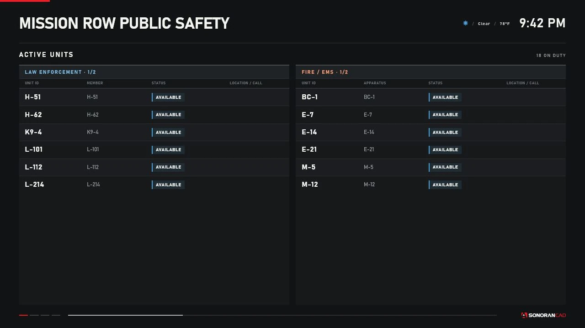

# Sonoran Station Displays

Sonoran Station Displays creates persistent, independently configured public-safety displays inside a FiveM server. A police briefing room can show law-enforcement units, a fire station can show Fire/EMS units, and a dispatch center can rotate through combined units, active calls, a live map, and bodycams.

Each nearby display uses FiveM's direct-rendered browser interface (DUI). Objects and DUI instances are created and removed by distance, with a per-client pool limit to control memory and rendering cost.

<figure><figcaption><p>The production display renderer at its shipped 1280 by 720 resolution, using controlled sample data.</p></figcaption></figure>

## Features

* Live on-duty units from the SonoranCADFiveM unit cache
* Independent `LEO`, `FIRE_EMS`, or `BOTH` service filtering per display
* Active Units, Emergency Calls, Dispatch Calls, Live Map, and Bodycams pages
* Ordered pages, a saved default page, and automatic rotation from 5 to 300 seconds
* Nearby viewer controls for synchronized page changes and temporary map panning
* Unit grouping and natural sorting, automatic list pagination, and configurable row limits
* A bundled, calibrated GTA V satellite map with unit, call, and station markers
* Live Sonoran bodycam viewing through the installed SonoranCADFiveM PeerJS/WebRTC runtime
* GTA/FiveM in-game clock and estimated weather in the display header
* In-game placement, movement, rotation, editing, preview, refresh, and deletion
* Server-side ACE or custom permissions, validation, rate limiting, and JSON persistence
* Optional server-only Discord-compatible administrative audit webhooks
* Client and server exports for supported integrations

## Data flow

The server reads the local `sonorancad` cache exports, normalizes one shared unit cache plus separate emergency and dispatch call caches, and sends full or incremental state only to players with view permission. Each client filters that state for its nearby displays.

SonoranCADFiveM determines whether a unit is on duty. A connected player is not automatically an active unit. The CAD `unit.data.page` value supplies the service category; agency and subdivision labels come from the cached unit.

Bodycams use a separate runtime interface supplied by a compatible SonoranCADFiveM bodycam build. Station Displays is a passive WebRTC viewer. It does not activate a bodycam, create a second capture loop, upload evidence, or accept arbitrary stream URLs.

See [SonoranCADFiveM Integration](sonorancad-integration.md).

## Display configuration

Create a display through:

```text
/stationdisplay > Mounted Displays > Place New Display
```

Every display saves its model, transform, world context, service filter, pages and page order, rotation, grouping, sorting, map behavior, bodycam layout, row limits, render distance, and interaction distance. Displays in the same building can therefore have different roles.

The management and placement flow was adapted from Sonoran's `radio_fivem` menu patterns, but Station Displays ships its own code and has no radio runtime dependency.

## Requirements

| Requirement | Type | Notes |
| --- | --- | --- |
| Current FXServer with OneSync | Runtime | Server-side position and routing-bucket validation depends on OneSync behavior. No artifact build number is enforced. |
| SonoranCADFiveM `4.0.72` or newer | Required | Supplies the unit, dispatch-call, and emergency-call cache exports. The resource must be named `sonorancad`. |
| Compatible Sonoran bodycam runtime | Bodycams only | Must supply `GetBodycamRuntime()` and `SonoranCAD::bodycam::RuntimeChanged` in `PEER_STREAM` mode. See [Bodycams](bodycams.md). |
| FiveM Asset Escrow entitlement | Distribution | The paid resource is delivered through the CFX portal after Tebex purchase. |
| Framework, SQL database, Node.js, or `radio_fivem` | Not required | The resource is standalone and ships production web files. |

## Default models

| Label | Model | Rendering |
| --- | --- | --- |
| Flat Screen TV | `prop_tv_flat_01` | Independent `WORLD_PLANE` surface |
| Laptop Display | `prop_laptop_jimmy` | Independent `WORLD_PLANE` surface |

Custom models require tested local screen geometry. GTA named render targets and texture replacement are shared at the model level and cannot guarantee independent content on identical props. See [Configuration](configuration.md#display-model-registry).

## Important limitations

* The DUI is 1280 by 720 (16:9). A differently proportioned model surface can stretch or crop.
* The satellite map is a lightweight operational view, not the full Sonoran CAD map, a route planner, or the FiveM pause map.
* `FOLLOW_UNITS` currently uses the same unit-based viewport calculation as `AUTO_FIT`.
* Stale unit state affects map marker styling, but the Active Units table has no separate stale badge.
* The management menu does not expose a routing-bucket field. Saved or externally provisioned bucket values are honored.
* Bodycam tiles consume real WebRTC viewer connections and may expose sensitive roleplay information.
* Model geometry and placement must be verified in the server's own interiors and map build.

## Documentation

Start with [Installation](installation.md), then review [Configuration](configuration.md), [Permissions](permissions.md), and [Display Management](display-management.md). Operational details are split into [Active Units](active-units.md), [Calls](calls.md), [Localized Live Map](live-map.md), [Bodycams](bodycams.md), and [In-game Clock and Weather](in-game-clock.md).

Release history and implementation limitations are tracked in the [Changelog](changelog.md).
