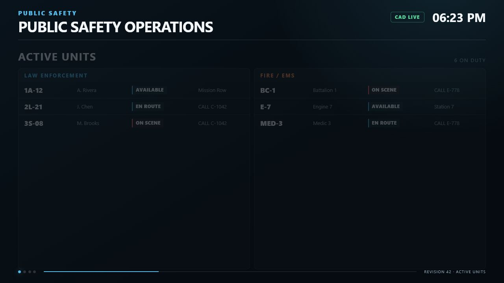

# Sonoran Station Displays

Sonoran Station Displays creates persistent, independently configured public-safety displays inside a FiveM server. A police briefing room can show law-enforcement units while a fire station shows Fire/EMS units and a dispatch center rotates through combined units, active calls, and a localized live map.

Each nearby display uses a direct-rendered user interface (DUI), which is FiveM's browser-based texture system. The resource creates and removes display objects and DUI instances by distance to limit client load.

<figure><figcaption><p>The shipped display interface rendered with sample data.</p></figcaption></figure>

## Main features

* Live on-duty units from the SonoranCADFiveM unit cache
* Independent `LEO`, `FIRE_EMS`, or `BOTH` service filter on every display
* Active Units, Emergency Calls, Dispatch Calls, and Live Map pages
* Configurable page order, default page, and automatic rotation
* 30-second default rotation interval, adjustable from 5 to 300 seconds
* Unit grouping and sorting, automatic list pagination, and configurable row limits
* Local coordinate map with unit, call, and station markers
* In-game placement, movement, rotation, editing, preview, refresh, and deletion
* Server-side ACE or custom permissions, validation, rate limiting, and JSON persistence
* Distance-managed display objects and a configurable maximum DUI pool
* Client and server exports for supported integrations

## How CAD data reaches a display

Sonoran Station Displays reads the supported local cache exports from the `sonorancad` resource. It normalizes one shared server cache, sends authorized clients full or incremental updates, and filters that client cache for each nearby display.

The SonoranCADFiveM cache determines whether a unit is on duty. A connected player is not automatically treated as an on-duty unit. Server owners normally do not configure department names: agency and subdivision labels come from cached unit data, while `unit.data.page` supplies the service category.

See [SonoranCADFiveM Integration](sonorancad-integration.md) for cache fields, update behavior, and classification rules.

## Display configuration

Mounted displays are created through:

```text
/stationdisplay → Mounted Displays → Place New Display
```

Every display saves its own model, transform, service filter, enabled pages, page order, default page, rotation settings, grouping, sorting, map options, row limits, render distance, and world context. Two displays in the same building can therefore show different services or pages.

The menu and placement flow were adapted from the existing `radio_fivem` speaker-menu logic so the controls feel consistent with other Sonoran resources. Sonoran Station Displays includes its own adapted WarMenu and placement code. It does not call radio menu exports, and `radio_fivem` is not a runtime dependency.

## Localized live map

The Live Map page plots cached GTA world coordinates on a lightweight local grid. It can show visible units, calls with coordinates, and the mounted display location. It does not use map tiles, external map services, API keys, or the full Sonoran CAD map.

The map is intended as a nearby operational overview. It is not a replacement for the full CAD map, street navigation, or the FiveM pause-menu map.

## Requirements

| Requirement | Type | Notes |
| --- | --- | --- |
| Current FXServer with OneSync | Runtime | Server-side player position and routing-bucket checks require OneSync behavior. No artifact build number is enforced. |
| SonoranCADFiveM `4.0.72` or newer | Required runtime dependency | Default resource name: `sonorancad`. |
| FiveM Asset Escrow entitlement | Distribution | The paid resource is delivered through the CFX portal after Tebex purchase. |
| `radio_fivem` | Reference implementation only | Not required or called at runtime. |
| Framework or database | Not required | Standalone resource; display data is saved as JSON. |
| Node.js | Not required | The interface ships as production HTML, CSS, and JavaScript with no bundler. |

## Supported display models

The default registry includes:

| Label | Model | Default renderer |
| --- | --- | --- |
| Flat Screen TV | `prop_tv_flat_01` | `WORLD_PLANE` |
| Laptop Display | `prop_laptop_jimmy` | `WORLD_PLANE` |

`WORLD_PLANE` renders a unique 16:9 surface for each display and is the supported default. Custom models require tested local screen offsets. Named render targets and texture replacement are model-global in GTA and cannot guarantee independent content on multiple identical props.

See [Configuration](configuration.md#display-model-registry) before adding a custom model.

## Important limitations

* The bundled DUI resolution is 1280×720 (16:9). Other surface proportions may stretch or crop unless their model configuration is calibrated.
* The Live Map is a coordinate grid, not a road map.
* `FOLLOW_UNITS` currently recalculates the same unit-based viewport as `AUTO_FIT`.
* Per-unit stale state is tracked internally but is not shown as a separate row badge in version 1.0.0. A failed CAD cache displays the full disconnected overlay.
* The management menu does not expose a routing-bucket field. Persisted or externally provisioned bucket values are honored.
* The included model offsets and orientation still require normal in-game release-candidate verification on the server's chosen map and interiors.

## Documentation


[installation.md](installation.md)



[configuration.md](configuration.md)



[display-management.md](display-management.md)



[troubleshooting.md](troubleshooting.md)


## Changelog

### Version 1.0.0 — July 27, 2026

**Added**

* Persistent mounted displays with LEO, Fire/EMS, and combined filtering
* Active Units, Emergency Calls, Dispatch Calls, and localized Live Map pages
* Automatic page rotation, unit grouping and sorting, and list pagination
* Self-contained display-management and placement menu
* SonoranCADFiveM cache integration, restart recovery, and disconnected state
* ACE/custom permissions, server validation, rate limiting, diagnostics, and developer exports
* Distance-managed DUI rendering with a configurable pool limit

**Security**

* Server-side permission, proximity, model, enum, range, and string validation for player mutations
* Caller information hidden by default

**Known limitations**

* Runtime pause/resume is not exposed in the shipped WarMenu.
* Per-record stale state has no dedicated visual badge.
* Named render targets and texture replacement are unsuitable for independent content on identical model instances.

