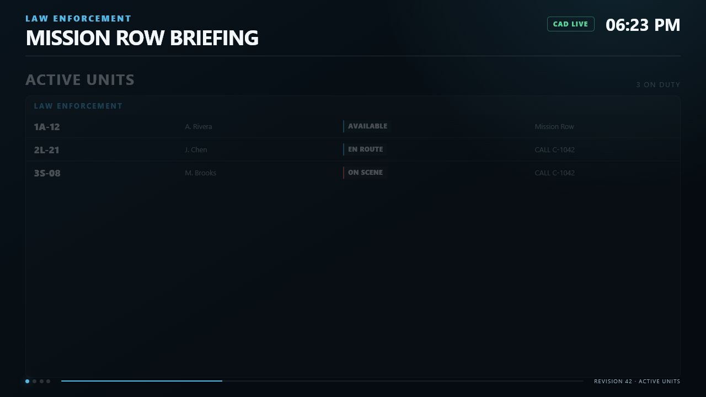
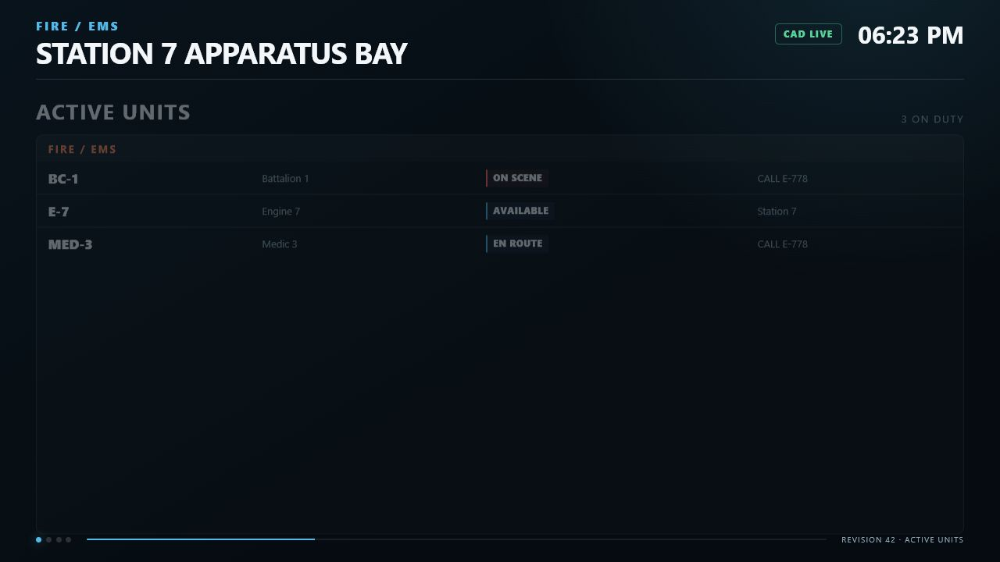

# Active Units

The Active Units page shows entries from the SonoranCADFiveM on-duty unit cache. Server owners do not need to define every department.

<figure><figcaption><p>The shipped LEO Active Units interface rendered with sample data.</p></figcaption></figure>

<figure><figcaption><p>The shipped Fire/EMS Active Units interface rendered with sample data.</p></figcaption></figure>

## Duty and service

An entry must be present in `GetUnitCache()` and must not have offline status `100`. Player connection alone is not duty status.

Service comes from `unit.data.page`:

* Police (`0`) → `LEO`
* Fire (`1`) or EMS (`2`) → `FIRE_EMS`
* Dispatch (`3`) or unknown → `OTHER`

`OTHER` units are not shown on Active Units. The combined filter shows LEO and Fire/EMS, not `OTHER`.

## Displayed fields

Each row renders:

| Field | Fallback |
| --- | --- |
| Callsign | Cached unit number/callsign/group, then `UNIT` |
| Name | Cached name, then agency, then `On Duty` |
| Status | Normalized label or raw status/`UNKNOWN` |
| Assignment/location | `CALL <id>` when assigned; otherwise location, then postal |

Agency or subdivision may also appear as a group heading.

The normalized cache includes rank, district, group, coordinates, player association, panic, and update data, but version 1.0.0 does not render each of those as a row field. Panic callsigns receive a visual panic class.

Long callsigns, names, and locations are escaped and truncated with an ellipsis to protect the display layout. Missing values use the fallbacks above.

## Status values

| CAD status code | Display label |
| --- | --- |
| `0` | `UNAVAILABLE` |
| `1` | `BUSY` |
| `2` | `AVAILABLE` |
| `3` | `EN ROUTE` |
| `4` | `ON SCENE` |
| `100` | `OFFLINE` and excluded |

Unknown codes show the raw cached status or `UNKNOWN`.

Enable **Hide Unavailable Units** on a display to exclude status code `0`.

## Grouping

| Config value | Menu label | Behavior |
| --- | --- | --- |
| `SERVICE` | By Service | Law Enforcement and Fire/EMS columns where applicable |
| `AGENCY` | By Agency | Cached agency; missing values use `UNASSIGNED AGENCY` |
| `SUBDIVISION` | By Subdivision | Cached subdivision; missing values use `NO SUBDIVISION` |
| `NONE` | Disabled | One `ON-DUTY UNITS` group |

Empty groups are not created. A display with no matching units shows:

```text
NO ON-DUTY UNITS
The selected service has no active units
```

## Sorting

| Config value | Field |
| --- | --- |
| `CALLSIGN` | Callsign |
| `STATUS` | Display status label |
| `AGENCY` | Agency |
| `SUBDIVISION` | Subdivision |

Sorting uses case-insensitive, numeric-aware browser ordering. Callsigns such as `1A-2` therefore sort naturally before `1A-10`.

## Pagination and maximum rows

The default row budget is 12 and the allowed per-display range is 4–40.

When multiple groups are present, the budget is divided evenly across the number of groups with a minimum of one row per group. Each group automatically changes its list page every 10 seconds and shows `current/total` beside the group heading.

## Assignment and location

Dispatch call assignments are matched using the call cache's `idents` or `units` values. When a match is found:

* The unit row shows `CALL <call ID>`.
* The call card lists the unit's callsign.
* The map can add the call ID beneath the unit marker.

If no assignment exists, cached location is preferred over postal.

## Stale and missing data

An unchanged unit is marked stale internally after `Config.StaleAfterSeconds` (30 seconds by default). Version 1.0.0 does not visually label individual stale rows. If a cache call fails, the display shows the disconnected overlay.

Use diagnostics and `sonorancad viewcaches` to investigate a frozen or missing unit.
