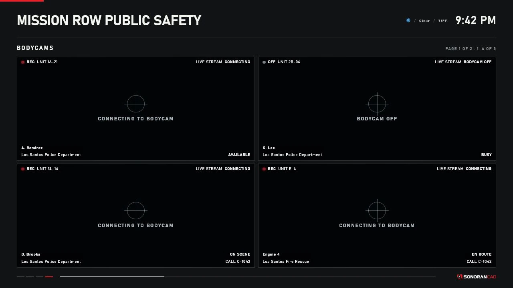
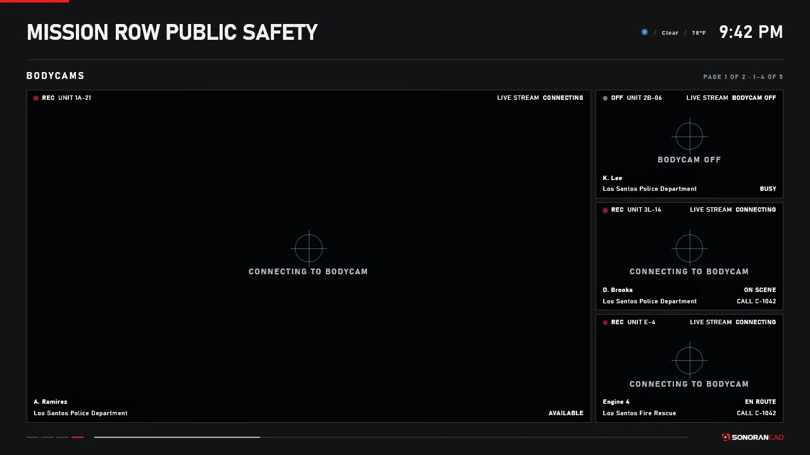
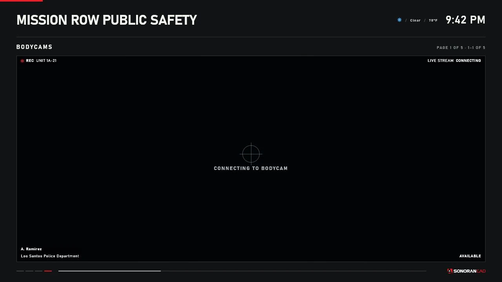

# Bodycams

The `BODYCAMS` page passively views active, on-duty Sonoran bodycams. The current integration uses continuous PeerJS/WebRTC streams supplied by SonoranCADFiveM. Station Displays does not take periodic screenshots, create a second capture timer, start an officer's bodycam, or upload recordings.

<figure><figcaption><p>The production four-tile renderer. This controlled capture shows honest connecting/off states and contains no officer footage.</p></figcaption></figure>

## Requirements

* Start the core resource as `sonorancad` before `sonoran-stationdisplay`.
* Install a SonoranCADFiveM package/build that supplies `GetBodycamRuntime()` and `SonoranCAD::bodycam::RuntimeChanged`.
* Enable the Sonoran bodycam submodule and `peerStream`.
* Use a plan/submodule entitlement that includes bodycams.
* Put the player on duty and activate the bodycam.
* Grant display viewers `sonoran.display.view`.

The general cache minimum remains SonoranCADFiveM `4.0.72`. That number does not prove that every `4.0.72` package includes the newer bodycam bridge. Check the installed build's exports or the Station Displays diagnostic. A runtime in `STATE_ONLY` or `DISABLED` mode cannot supply video; Station Displays needs `PEER_STREAM`, `streamReady`, and a valid peer ID.

## Association and service filtering

SonoranCADFiveM associates each publisher with a player source and CAD unit. Station Displays joins it to the normalized unit cache for callsign, name, agency, service, status, and assigned call.

* `LEO` shows police-page units.
* `FIRE_EMS` shows fire and EMS-page units.
* `BOTH` shows both.

A feed is removed after player disconnect or when the required on-duty association disappears. Player source reuse is checked against the owning runtime record.

## Layouts

| Layout | Behavior |
| --- | --- |
| `AUTO` | One feed uses single; multiple feeds use grid. |
| `SINGLE` | One large feed per bodycam page. |
| `GRID` | Up to four feeds in a 2-by-1 or 2-by-2 grid. |
| `FOCUSED` | One large feed plus a narrow secondary rail. |

<figure><figcaption><p>Focused layout with one primary tile and a secondary rail.</p></figcaption></figure>

<figure><figcaption><p>Single layout uses the full content area for one viewer.</p></figcaption></figure>

`AUTO` selects the same single presentation for one feed and the grid presentation for
multiple feeds. The captured multi-feed Auto state is available as
`station-displays-bodycams-auto.webp` in the documentation assets.

`maximumFeeds` accepts 1 through 4 per bodycam page. Extra feeds create additional bodycam pages. Those pages rotate independently from the mounted display's main page, using the saved bodycam interval (15 seconds by default). Page Down/Page Up moves between bodycam pages on the targeted DUI.

## Overlay and feed states

The overlay can show recording state, callsign, unit name, agency, unit status, assigned call, and stream signal. It deliberately omits fake battery/GPS/serial/bitrate fields, manufacturer branding, and evidentiary claims.

| State | Meaning |
| --- | --- |
| `CONNECTING TO BODYCAM` | Runtime exists but peer/video playback is not ready. |
| `LIVE` | Video is playing and frames are advancing. |
| `SIGNAL DELAY` | No advancing frame for the delayed threshold, default 8 seconds. |
| `FEED UNAVAILABLE` | Peer/video failed or the stall passed the unavailable threshold, default 30 seconds. |
| `BODYCAM OFF` | Inactive associated unit, visible only when configured. |

WebRTC has no periodic capture timestamp. The current UI does not render `Config.Bodycams.showTimestamp`, even though the setting is saved/normalized. The station header continues to show GTA/FiveM time. Audio is muted.

## Security and privacy

The display accepts no feed URL, PeerJS host, CAD API key, upload token, or client-provided ICE configuration. The viewer host is pinned to Sonoran's PeerJS service; runtime peer IDs are length-limited and inactive publishers are rejected. Short-lived ICE/TURN data comes from the authenticated Sonoran runtime, not Station Displays configuration.

Mounted displays identify themselves as passive viewers. They do not set an officer's watched state or prevent the officer from switching off.

Bodycam video can contain sensitive roleplay information. Restrict view ACE, display interiors, and routing buckets. Avoid placing a bodycam page on a publicly accessible screen.

## Performance and viewer limits

Each visible tile is a real WebRTC connection. The currently audited publisher allows four viewers per feed. Different FiveM clients and different display DUI instances cannot share one browser `MediaStream`.

Use conservative render distances and feed limits. Prefer `SINGLE` when several clients can view the same bodycam. A Station Display can consume a publisher viewer slot even though it is passive.

## Integration interface

```lua
exports["sonorancad"]:GetBodycamRuntime()
```

```text
SonoranCAD::bodycam::RuntimeChanged
```

The normalized runtime includes association metadata plus `active`, `mode`, `peerId`, `streamReady`, `streamReason`, `activatedAt`, `updatedAt`, and `sequence`. Feed state is runtime-only and is never stored in `data/displays.json`.

Routine feed changes and Page Up/Page Down viewing are not administrative webhook actions. Changes to a display's bodycam page configuration are audited.

## Troubleshooting

### No bodycams appear

Check entitlement/submodule state, `peerStream.enabled`, on-duty state, activation, service filter, enabled `BODYCAMS` page, and diagnostic runtime counts.

### Connecting never becomes live

The publisher has not announced a ready peer stream or the viewer cannot establish it. Review the Sonoran client console for canvas renderer, PeerJS signaling, STUN/TURN, NAT, and browser playback errors.

### Feed becomes delayed or unavailable

Check player connectivity, PeerJS/TURN reachability, publisher viewer count, and browser errors. The diagnostic load-failure count records explicit peer/call/video failures.

### Wrong or old officer

Verify `GetUnitByPlayerId(source)`, duty state, and disconnect/logout events. The bridge should remove an off-duty/disconnected publisher.

### Bandwidth is high

Reduce maximum feeds, select `SINGLE`, increase bodycam pagination time, reduce overlapping render distances, and confirm only intended clients have view access.
