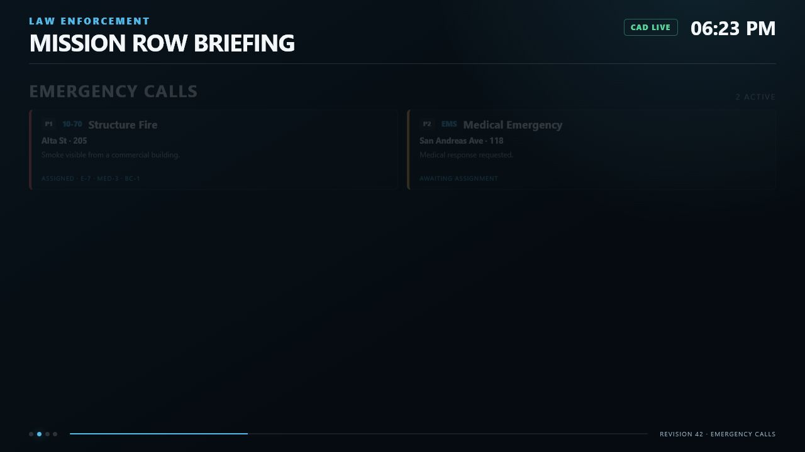
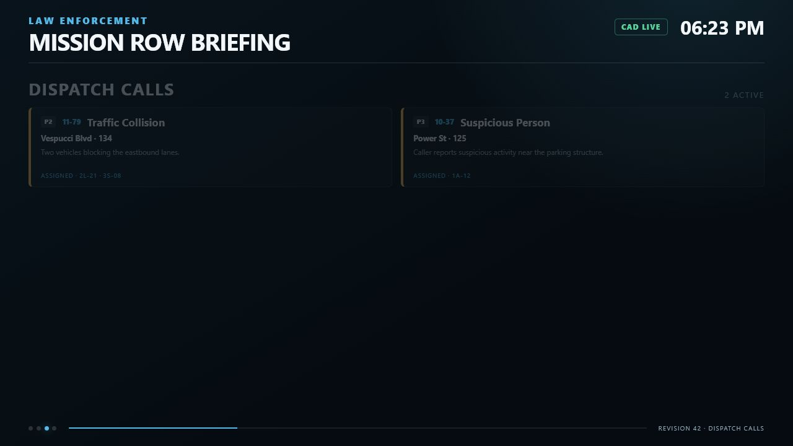

# Calls

Sonoran Station Displays provides two call pages because SonoranCADFiveM exposes two separate caches.

## Emergency Calls

Source:

```lua
exports["sonorancad"]:GetEmergencyCache()
```

Emergency entries are normalized as `EMERGENCY_CALL` while they remain in the cache. The default title is `Emergency Call` when `isEmergency` is true, otherwise `Incoming Call`. Default priority is `1` for an emergency and `0` for another incoming call.

<figure><figcaption><p>The shipped Emergency Calls interface rendered with sample data.</p></figcaption></figure>

## Dispatch Calls

Source:

```lua
exports["sonorancad"]:GetCallCache()
```

Dispatch entries are normalized as `DISPATCH_CALL`. Status `2` (`CLOSED`) is removed from the display cache. Default title is `Dispatch Call`.

<figure><figcaption><p>The shipped Dispatch Calls interface rendered with sample data.</p></figcaption></figure>

## Normalized fields

The adapter can normalize:

* Call ID, kind, title, and code
* Numeric priority
* Status
* Address/location and postal
* Description
* Assigned unit IDs and callsigns
* Emergency caller text when enabled
* World coordinates from `metaData`
* Created/updated values
* Service classification

## Visible call cards

Version 1.0.0 renders:

* Priority badge when `VisibleCallFields.priority = true`
* Call code when present
* Title
* Address and appended postal when `VisibleCallFields.address = true`
* Description when `VisibleCallFields.description = true`
* Assigned callsigns or `AWAITING ASSIGNMENT` when `VisibleCallFields.assignedUnits = true`

Titles and assigned-unit lines truncate with an ellipsis. Descriptions are clipped to a fixed two-line-height area.

Current renderer limitations:

* Status is normalized and sent but is not displayed.
* `VisibleCallFields.postal` is not an independent switch; postal follows the address block.
* Caller text is not rendered even if normalization is enabled.

Keep `VisibleCallFields.caller = false`.

## Service filtering

A call is classified from its assigned normalized units.

| Assignment | Call service |
| --- | --- |
| LEO only | `LEO` |
| Fire/EMS only | `FIRE_EMS` |
| Both | `BOTH` |
| None or only unclassified units | `OTHER` |

Filtering:

* LEO displays show `LEO` and `BOTH`.
* Fire/EMS displays show `FIRE_EMS` and `BOTH`.
* Both displays show every call, including `OTHER`.
* Optional fallback settings can show `OTHER` on a single-service display.

The resource does not infer service from call titles or department text.

## Priorities and sorting

Priority is a number and receives a `priority-<number>` CSS class. The shipped renderer does not reorder calls. Calls retain the normalized cache iteration order; do not depend on priority or creation-time sorting.

## Pagination and maximum calls

The default maximum is eight call cards and the allowed per-display range is 2–30. Large lists automatically move to the next list page every 10 seconds.

## Stale calls and removal

Version 1.0.0 does not age out or visually mark individual calls by timestamp.

* Dispatch calls disappear when closed or removed from `GetCallCache()`.
* Emergency calls disappear when removed from `GetEmergencyCache()`.
* Cache deltas remove the client entry.
* A failed cache call changes the connection to disconnected.

## Calls without coordinates

A call without usable X/Y values still appears on the corresponding call page. It does not receive a Live Map marker.

## Sensitive information

The board is an in-world display. Review all fields before granting `sonoran.display.view`.

Recommended public-facing configuration:

```lua
Config.VisibleCallFields = {
    priority = true,
    status = true,
    address = true,
    postal = true,
    description = true,
    assignedUnits = true,
    caller = false
}
```

Disable description or address if those values are inappropriate for the display's audience.
