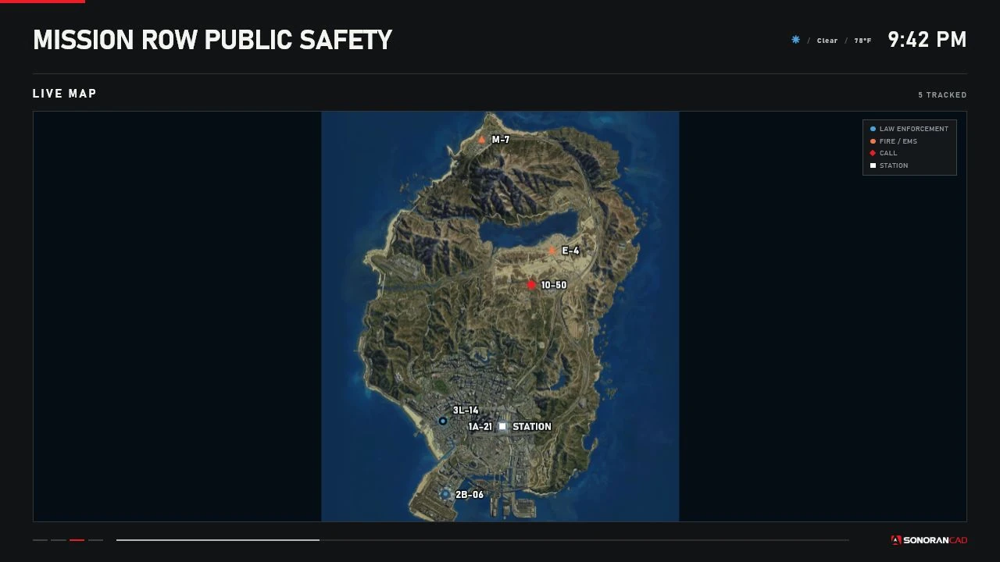
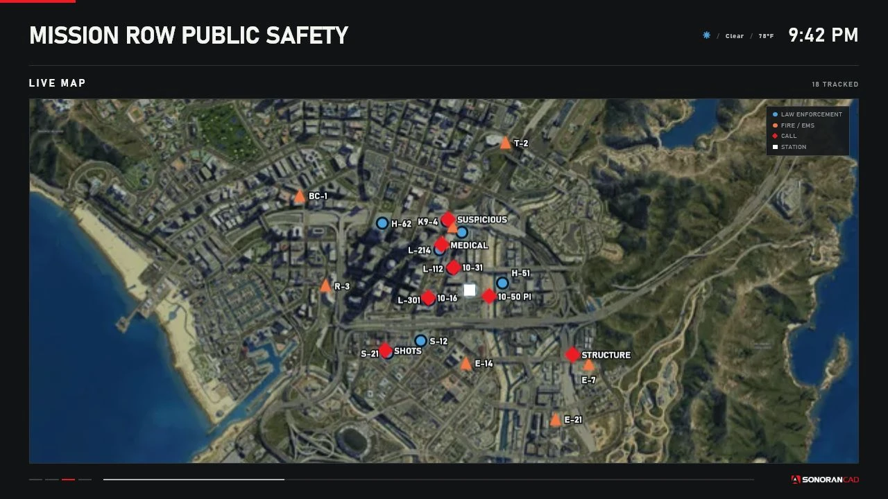
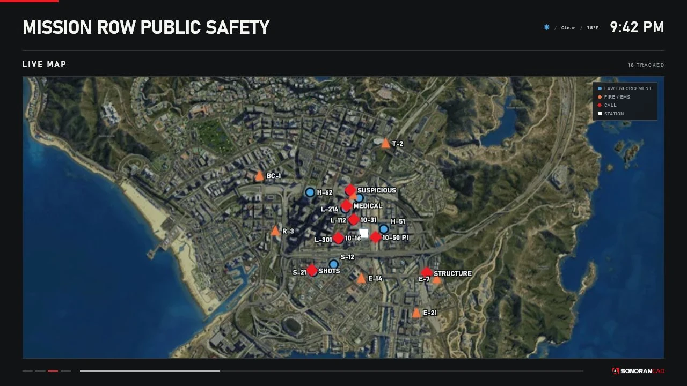
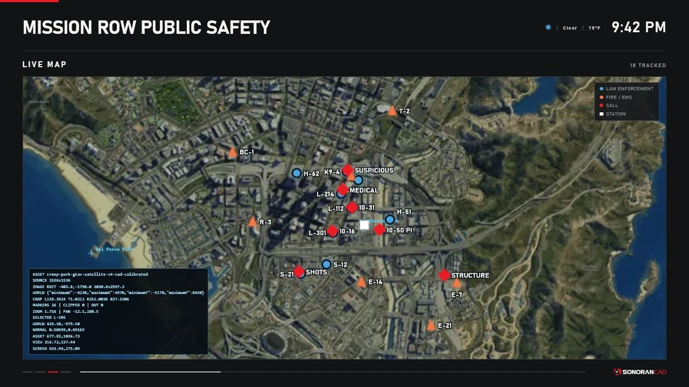

# Localized Live Map

The `LIVE_MAP` page plots cached GTA world coordinates over a bundled GTA V satellite image. It uses no external map service, API key, or runtime tile requests.

<figure><figcaption><p>Auto Fit with controlled unit, call, and station markers.</p></figcaption></figure>

<figure><figcaption><p>A sparse dataset expands to a full-island operational view.</p></figcaption></figure>

## Bundled asset and calibration

The production asset is `web/assets/gtav-satellite-z4.webp`, derived from the MIT-licensed CreepPork GTAV-Maps project. Station Displays crops the source image to its useful play-area rectangle and projects world coordinates into that cropped rectangle before fitting it into the 16:9 map viewport.

The calibrated bounds are:

| Axis | Minimum | Maximum |
| --- | ---: | ---: |
| GTA world X | `-4230` | `4970` |
| GTA world Y | `-5170` | `8420` |

World X increases east/right. World Y increases north/up; image Y is inverted during projection because browser pixels increase downward. The renderer also accounts for letterboxing so markers remain aligned with the visible image instead of the unused side bands.

Calibration was checked against representative locations including LSIA, Mission Row, Del Perro, Sandy Shores, Grapeseed, Paleto Bay, Fort Zancudo, Mount Chiliad, Humane Labs, and Terminal.

## Marker sources

| Marker | Source | Appearance |
| --- | --- | --- |
| LEO unit | Normalized unit coordinates | Blue circle and callsign |
| Fire/EMS unit | Normalized unit coordinates | Orange circle and callsign |
| Call | Call `metaData` X/Y | Red diamond and call label |
| Station | Saved display position | White square labeled `STATION` |

The display's service filter is applied before map state is built. Calls without usable coordinates remain on their list page but have no map marker. Stale unit markers use reduced opacity and a dashed outline.

## Modes

### Auto Fit - `AUTO_FIT`

Fits all valid visible unit, call, and enabled station points. The configured padding and minimum/maximum spans keep extremely tight or wide datasets usable.

### Follow Units - `FOLLOW_UNITS`

Fits valid unit points and ignores calls/station when choosing the viewport. It follows the visible unit group rather than one selected officer. In the current release, a normal dataset can look identical to Auto Fit.

<figure><figcaption><p>Follow Units using the same dense controlled unit dataset as Auto Fit; the matching viewport is expected for this dataset.</p></figcaption></figure>

### Fixed Region - `FIXED_REGION`

Uses the saved center and zoom:

* Center X/Y: `-20000` to `20000`
* Zoom: `0.1` to `10.0`
* Default center: `215, -810`
* Default zoom: `1.0`

<figure><figcaption><p>A saved fixed-region viewport.</p></figcaption></figure>

## Nearby map controls

When `Config.MapInteraction.enabled` is true and the targeted display is currently on Live Map:

| Default key | Action |
| --- | --- |
| Numpad 8 / 2 | Pan north / south |
| Numpad 4 / 6 | Pan west / east |
| Numpad 5 | Reset temporary pan |

Panning is temporary and synchronized to authorized nearby viewers. It is not written to `data/displays.json`. Leaving the Live Map page or using reset restores the display's saved map mode.

Target selection uses each display's interaction distance, camera angle, line of sight, routing bucket, and interior. All bindings are rebindable in FiveM settings.

## Configuration

Per-display options are under:

```text
Display Configuration > Map Behavior
```

Global defaults live in `Config.Map`: mode, center, zoom, minimum/maximum span, padding, call visibility, station-marker visibility, and the debug overlay.

Map state follows shared cache changes. Unit polling defaults to 2 seconds and call polling to 3 seconds. `Config.MapRefreshInterval` exists for compatibility but is not read by the current renderer.

## Debug overlay

Set `Config.Map.debug = true` only while calibrating or troubleshooting. The overlay reports asset and crop dimensions, configured bounds, clipping, selected viewport points, and projection values.

<figure><figcaption><p>Projection diagnostics rendered over the production map.</p></figcaption></figure>

Debug data can reveal coordinates and is visually noisy; disable it after testing.

## Limitations

* Raster imagery and GTA coordinate sources have finite positional accuracy.
* Dense labels can overlap even though the renderer offsets nearby labels.
* Records outside the calibrated bounds are excluded from production rendering; debug mode reports clipping.
* The map has no routing, navigation, external layers, or customer-selectable tile source.
* `FOLLOW_UNITS` follows the visible group, not a selected unit.
