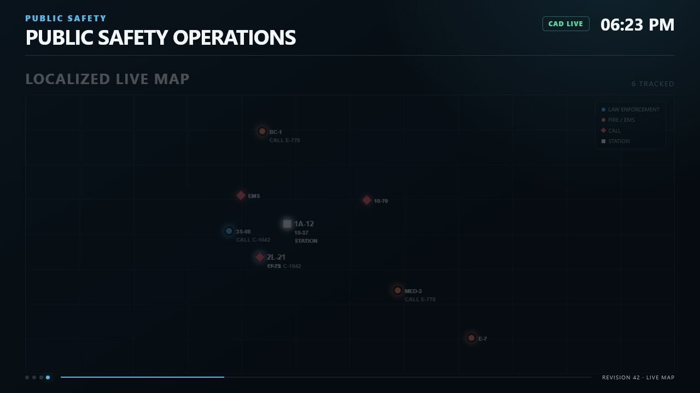

# Localized Live Map

The `LIVE_MAP` page is a lightweight in-game operational overview. It plots cached GTA world coordinates on a grid and does not load external map tiles or require an API key.

<figure><figcaption><p>The shipped localized map interface rendered with sample data.</p></figcaption></figure>

## Coordinate sources

| Marker | Source |
| --- | --- |
| LEO unit | Normalized `unit.coordinates` or `unit.coords` |
| Fire/EMS unit | Normalized `unit.coordinates` or `unit.coords` |
| Call | X/Y values from call `metaData` |
| Station | Saved mounted display position |

X increases to the right. Y increases upward. Z is accepted and normalized but is not used by the 2D projection.

## Markers

| Marker | Appearance |
| --- | --- |
| LEO | Blue circle with callsign |
| Fire/EMS | Orange circle with callsign |
| Call | Red diamond with code/title |
| Station | White square labeled `STATION` |

An assigned call ID can appear below a unit label.

The display service filter is applied before map state is built. A LEO display does not receive Fire/EMS markers, and a Fire/EMS display does not receive LEO markers.

## Map modes

### Auto Fit — `AUTO_FIT`

Continuously calculates a viewport from visible unit coordinates. If there are no unit markers, it fits all available points. When units exist, call and station markers do not expand the primary fit and may fall outside the viewport.

The renderer enforces a minimum span of 600 world units horizontally and 420 vertically, then adjusts for the display aspect ratio.

### Follow Units — `FOLLOW_UNITS`

Version 1.0.0 uses the same continuously recalculated unit fit as Auto Fit. It does not follow a selected unit.

### Fixed Region — `FIXED_REGION`

Uses the saved X/Y center and zoom:

* Center range: `-20000` to `20000`
* Zoom range: `0.1` to `10.0`
* Horizontal span: `3000 / zoom`

Use this when a station should always show a known district.

## Configure a display

Open:

```text
Display Configuration → Map Behavior
```

Options:

* Map Mode
* Show Calls
* Show Station Marker
* Map Zoom
* Map Center X/Y in Fixed Region

Map settings are saved per display.

## Empty map

If no coordinate records are available, the grid still renders with a default center/span. The unit count can be zero. A station marker appears if enabled, because every saved display has a world position.

If the page is completely blank rather than an empty grid, investigate DUI readiness and client errors.

## Update and staleness

Map markers update when normalized cache state changes. Unit coordinates are covered by the central unit poll, which defaults to 2 seconds. Call coordinates follow the central call poll, which defaults to 3 seconds.

The renderer sends changed display state and redraws the canvas. It does not run a separate map-coordinate network loop.

`Config.MapRefreshInterval` is not read in version 1.0.0. Lowering it does not increase map freshness.

Per-record stale flags are not drawn. If the CAD cache becomes unavailable, the disconnected overlay appears.

## Performance

Map cost is mainly:

* One canvas redraw when display state changes
* Projection and label placement for visible markers
* The existing DUI resolution

Reduce nearby active displays or render distance before reducing CAD poll intervals. Call markers can be disabled per display if they add unnecessary visual density.

## Custom map assets

Version 1.0.0 has no customer configuration for tiles, images, or custom map assets. Do not embed a paid map provider, external URL, or API key in the resource.

## Limitations

The localized map:

* Has no roads, street names, terrain, routing, or navigation
* Does not reproduce the full Sonoran CAD map
* Does not show records without coordinates
* Does not prevent label overlap in very dense clusters, although it offsets nearby labels
* Uses identical behavior for Auto Fit and Follow Units in version 1.0.0
* Can leave call markers outside the viewport when unit markers define the fit
